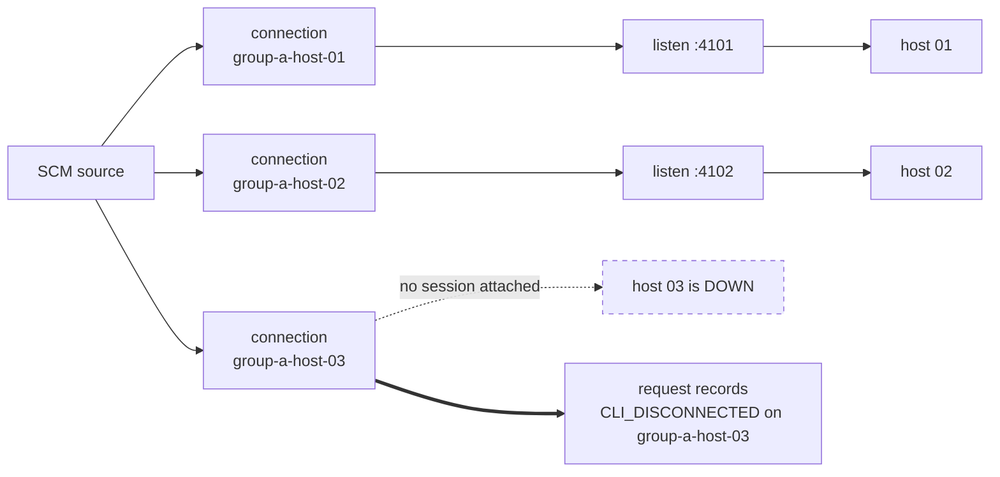
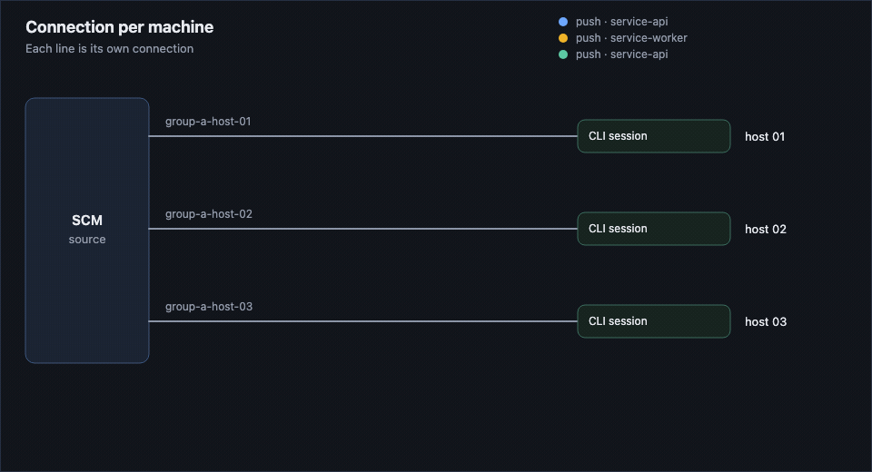
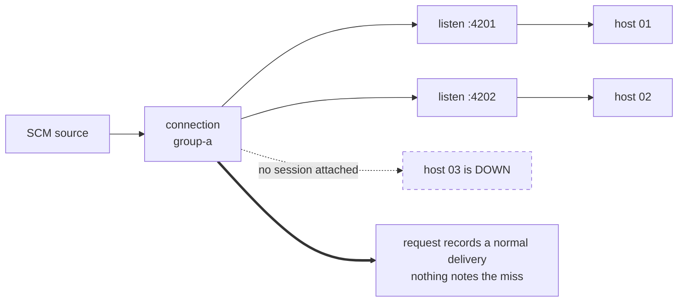
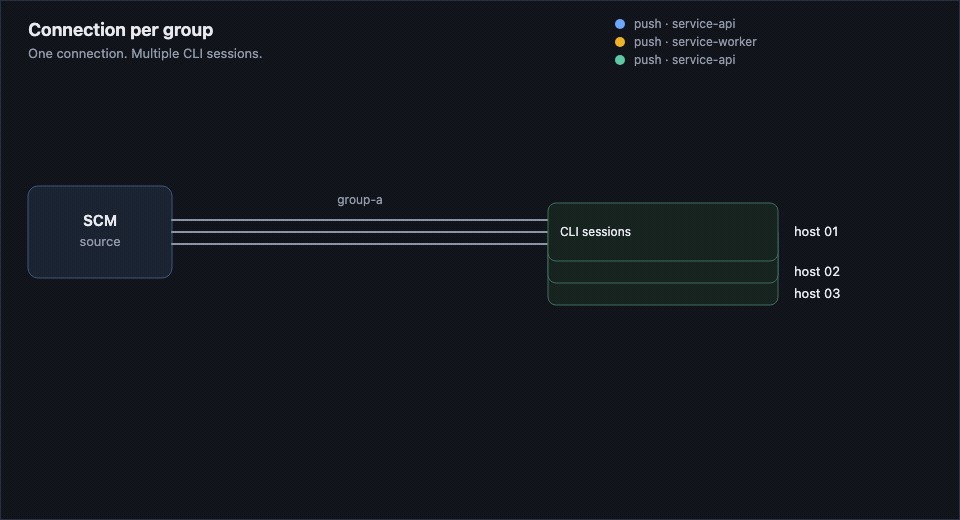

# Delivering webhooks to machines on a private network

*Several machines need the same event, none of them can be reached from the
internet, and you need to know when one of them didn't get it. Two ways to
model that with Hookdeck CLI destinations, compared under failure.*

Webhooks have to reach machines that sit on a private network with no
inbound route from the internet. The agents are organized into groups, and
every agent in a group must receive every event matching that group - they are
peers, not workers sharing a queue. Some groups are a single agent that
receives only its own repositories' events.

A `hookdeck listen` process on each machine solves the connectivity problem:
the machine dials out, and Hookdeck pushes events down that connection to a
local port. The question this demo answers is how to *model* the fleet, because
there are two ways to do it and they diverge sharply the moment a machine goes
down.

The difference is where the fan-out happens, and it decides everything else.

**Connection per machine fans out at the connection layer.** Each machine has a connection
of its own, so a connection *is* a machine. When one is down, the request names
it:





**Connection per group fans out at the session layer.** The group has one connection and
the machines are indistinguishable sessions on it. When one is down, the other
two still take delivery, so the request looks entirely healthy:





Both deliver every event to every machine that is up. Compare the two
bold-arrowed boxes: that is the whole argument. With a connection per machine,
the machine that missed an event is named in the request's record, so it can be
replayed to on its own. With a connection per group, the request looks fine,
because as far as Hookdeck is concerned the destination was reachable - just not
by every machine.

| | Connection per machine | Connection per group |
|---|---|---|
| Hookdeck resources | one connection + CLI destination per machine | one connection + CLI destination per group |
| Fan-out to every machine | yes, one event per connection | yes, one event per attached session |
| Can you see which machines are connected? | yes, each machine is its own connection | no, sessions are not exposed in the dashboard or API |
| Is a miss recorded when one machine is down? | yes, `CLI_DISCONNECTED` on that machine's connection | no, if other machines are up the request looks delivered |
| Can you replay to just the machine that missed? | yes, retry scoped to its connection | no, a retry reaches every attached session |
| Config surface | one entry per machine, in source control | one entry per group |

Connection per machine uses one connection per machine instead of one per group. That is not
a price paid for the rows above - it is what produces them. A connection is the
unit Hookdeck records delivery against, so modeling each machine as its own
connection is what makes each machine individually visible and individually
recoverable. Connection per group does not save anything by collapsing them; it discards
per-machine identity and gets nothing back.

Nor is it more expensive. Connections are unlimited on every plan, and billing
is on events and per-destination throughput. Both ways create one event
per machine. A connection per machine creates one per matching connection, and a connection per group creates one per
attached session, so the event count for a given fleet is the same either way.

The genuine cost of a connection per machine is config surface: one entry per machine to keep
in sync rather than one per group. That is what `fleet.yaml` plus an idempotent
upsert on machine launch is for. See [FINDINGS.md](FINDINGS.md) for the evidence
behind every row.

## How a machine is simulated

Each machine is one supervisor process that owns two things:

- a local HTTP server on its own port, standing in for the service on that machine, serving
  `POST /webhooks/scm` and logging every delivery
- a `hookdeck listen <port> <source> <connection> --output compact` child
  process forwarding that connection's events to it

The supervisor is spawned into its own process group, which is what makes the
failure modes demonstrable:

- `fleet down` sends `SIGTERM` to the supervisor only. It forwards `SIGINT` to
  `hookdeck listen`, which closes the WebSocket with code 1000 and Hookdeck
  drops the session immediately. This is the Ctrl+C path.
- `fleet crash` sends `SIGKILL` to the whole process group, so the listener
  dies with no close frame and the session stays held for the reconnect grace
  window (about 2 minutes).

Killing only the supervisor would orphan the listener, which would keep the
session attached and quietly invalidate every failure scenario.

## Setup

```bash
npm install
cp .env.example .env    # then fill it in
```

`npm install` brings the Hookdeck CLI with it - `hookdeck-cli` is a pinned
dependency, and every script runs `node_modules/.bin/hookdeck` rather than
whatever is on your `PATH`. Nothing needs installing globally, and a different
global version cannot change what the scenarios do. FINDINGS.md records results
against the pinned version for that reason.

`.env` needs a project API key for a **dedicated Event Gateway test project**
and a webhook secret:

```
HOOKDECK_API_KEY=...
GITHUB_WEBHOOK_SECRET=...      # openssl rand -hex 20
```

The demo authenticates with `hookdeck ci --api-key` into its own config file at
`run/hookdeck-cli.toml`, so it never touches the project you are logged into
interactively.

Create the Hookdeck resources for both approaches:

```bash
npm run setup               # add --dry-run to preview
```

Every resource is named with the `prefix` from [`fleet.yaml`](fleet.yaml)
(`fleet-demo` by default), so teardown can find them and nothing else in the
project is touched.

`setup` writes the resolved Hookdeck IDs to `run/setup.json`, which is
deliberately **not** in source control. Those IDs (`src_`, `web_`, `des_`) are
generated per project, so a committed copy would be wrong for everyone but the
person who generated it, and stale the moment anyone runs `teardown`.
[`fleet.yaml`](fleet.yaml) is the file that belongs in source control - it is
the declarative description of the fleet and its connections - and `npm run setup` re-derives the
IDs from it in seconds against whatever project your `.env` points at. Clone,
`.env`, `npm run setup`, and you have a working demo.

## The fleet

[`fleet.yaml`](fleet.yaml) is the source of truth. The top of the file is the fleet: groups and the hosts that must receive their repositories' events. Below that are the Hookdeck sources and connections. A connection is one source, one CLI destination, and a body filter, plus the hosts that listen on it. `npm run setup` upserts those connections as they are written.

```
group-a   group-a-host-01, group-a-host-02, group-a-host-03   demo-org/service-api, demo-org/service-worker
group-b   group-b-host-01                           demo-org/release-tooling
```

`group-b` is the one-to-one case: specific webhooks to one specific machine and
no other. A group of one, so the same config shape covers it.

Machines in the same group carry the same body filter on
`repository.full_name`, which is what makes all of them match the same events.

## Sending webhooks

Two ways, and they are interchangeable:

```bash
# Local sender. Signs with GITHUB_WEBHOOK_SECRET, so source verification runs
# exactly as it would in production.
npm run send -- --approach per-machine --repo demo-org/service-api --event push
npm run send -- --approach both --repo demo-org/release-tooling --count 3
```

Or point a real repository webhook at a source URL (`npm run setup` prints
them), content type `application/json`, secret `GITHUB_WEBHOOK_SECRET`. Use the
real repository for a recorded demo and the local sender for fast iteration.

## Running the fleet

```bash
npm run fleet -- up     per-machine              # start every machine
npm run fleet -- up     per-machine group-a-host-01   # or just one
npm run fleet -- status
npm run fleet -- logs   per-machine group-a-host-01   # tail it
npm run fleet -- down   per-machine group-a-host-01   # clean shutdown
npm run fleet -- crash  per-machine group-a-host-01   # simulated crash
```

Both approaches use separate sources and separate ports, so they can run side
by side against the same traffic:

```bash
npm run fleet -- up per-machine
npm run fleet -- up per-group
npm run send -- --approach both --repo demo-org/service-api
```

## Watching it

The animations above are frames of [viz/index.html](viz/index.html). The same page can drive the running fleet:

```bash
npm run viz
```

Open the printed URL. Setup upserts the connections in `fleet.yaml`, then starts a CLI session on each of them. Teardown stops those sessions first, then deletes every connection in the Hookdeck project and leaves the sources in place, so Setup can put the connections and the sessions back. With no connections the picture keeps the source and drops the routes, and the machine list and its up, down, and crash controls stay hidden. Send a push, and crash one host. Reset brings every host back up and clears the dots and the request record. A dot leaves the SCM source immediately. A session edge lights when that machine's own log records the delivery, which is the only per-machine signal a connection per group has. The request record is what the Hookdeck API stored: a connection per machine names the connection that missed, and a connection per group records a normal delivery when any session was attached.

## Seeing what Hookdeck recorded

```bash
npm run inspect -- --approach per-machine
```

This prints, per request, what each connection did with it - delivered, or
ignored and why. It is where the two models diverge most visibly: with a connection per machine, a downed machine leaves a `CLI_DISCONNECTED` row against its own
connection, while with a connection per group there is one row for the whole group and a
request delivered to two of three machines looks identical to one delivered to
all three.

## Recovering missed events

Only a connection per machine can do this properly:

```bash
npm run recover -- group-a-host-01 --dry-run
npm run recover -- group-a-host-01
npm run recover -- group-a-host-01 --since 2026-09-23T10:00:00Z
```

Bringing a per-machine host back up runs this once its CLI session connects.
It lists the source's requests since a time bound, keeps the ones with a
`CLI_DISCONNECTED` ignored event on that machine's connection, retries failed
events such as `CLI_UNAVAILABLE`, skips any that already have a successful
event on that connection, and retries the rest scoped to that connection alone.
The last run is recorded in `run/recover.<machine>.json` and used as the
default `--since` next time. The commands above run the same recovery by hand.

For a connection per group, `npm run group-recovery-problem -- group-a` demonstrates why
the equivalent does not exist, and `--retry` performs the group retry and
counts the duplicates it causes.

## Scenarios

Each one is scripted end to end and writes a transcript of every command and
its output to `evidence/<scenario>.<approach>.md`.

```bash
npm run scenario -- list
npm run scenario -- happy-path        --approach per-machine
npm run scenario -- down-long         --approach per-machine
npm run scenario -- down-short        --approach per-machine
npm run scenario -- group-down        --approach per-group
npm run scenario -- shutdown-vs-crash --approach per-machine
```

| Scenario | What it shows |
|---|---|
| `happy-path` | Every machine in group-a receives every event for the group's repos; `group-b-host-01` receives only its own repo's events |
| `down-long` | A machine crashes and stays down past the grace window. A connection per machine records the miss and recovers it to that machine alone; a connection per group records nothing and can only duplicate |
| `down-short` | A machine crashes and returns inside the grace window - what happens to events sent during the gap |
| `group-down` | The whole group is down; each machine recovers independently when each has its own connection |
| `shutdown-vs-crash` | A clean shutdown drops the session immediately; a crash holds it for the grace window |

`down-long`, `group-down` and `shutdown-vs-crash` wait out the ~2 minute grace
window, so they take a few minutes. Run them with `--gap 5` while iterating to
shorten the incidental waits (the grace-window waits are fixed, because
shortening them would change what is being measured).

Suggested order for a live demo: `happy-path`, then `down-long` on
`per-machine`, then `down-long` on `per-group` for the contrast. See
[DEMO-VIDEO-OUTLINE.md](DEMO-VIDEO-OUTLINE.md).

## Teardown

```bash
npm run teardown -- --dry-run   # list what matches the prefix
npm run teardown
```

Deletes every connection, destination and source whose name starts with the
prefix, then removes `run/`. Logs are kept.

## Layout

```
fleet.yaml                            groups, hosts, sources, and connections
shared/src/config.ts                  loads fleet.yaml
shared/src/hookdeck.ts                Hookdeck API client + CLI wrapper
shared/src/machine.ts                 one simulated machine (stub server + listener)
shared/src/fleet.ts                   process manager: up, down, crash, status, logs
shared/src/send-webhook.ts            signed GitHub-shaped webhook sender
shared/src/inspect.ts                 per-request, per-connection outcomes
shared/src/setup.ts                   create everything, idempotently
shared/src/teardown.ts                delete everything by prefix
shared/src/scenario.ts                scripted scenarios + evidence capture
per-machine/src/ensure-connection.ts  connection per machine: connection upsert
per-machine/src/recover.ts            connection per machine: targeted, duplicate-free recovery
per-group/src/ensure-group.ts         connection per group: connection upsert
per-group/src/recovery-problem.ts     connection per group: why recovery does not work
```

## Things worth knowing before you change this

- Create connections **before** running `listen`. If `listen` finds no
  connection for a source it creates one called `cli-<source>`, and every later
  `listen` on that source attaches to it - silently collapsing a connection per
  machine into a connection per group.
- Always pass the exact connection name to `listen`. The connection argument
  also matches a substring of the CLI path, so passing `/webhooks/scm` would
  match every connection whose path contains it.
- Never use `listen --path`. It writes the CLI path to the server and it
  persists. Set the path with `--destination-cli-path` on the connection.
- A CLI destination delivers only to sessions attached at the time. Events that
  arrive while nothing is listening are discarded, not queued.
