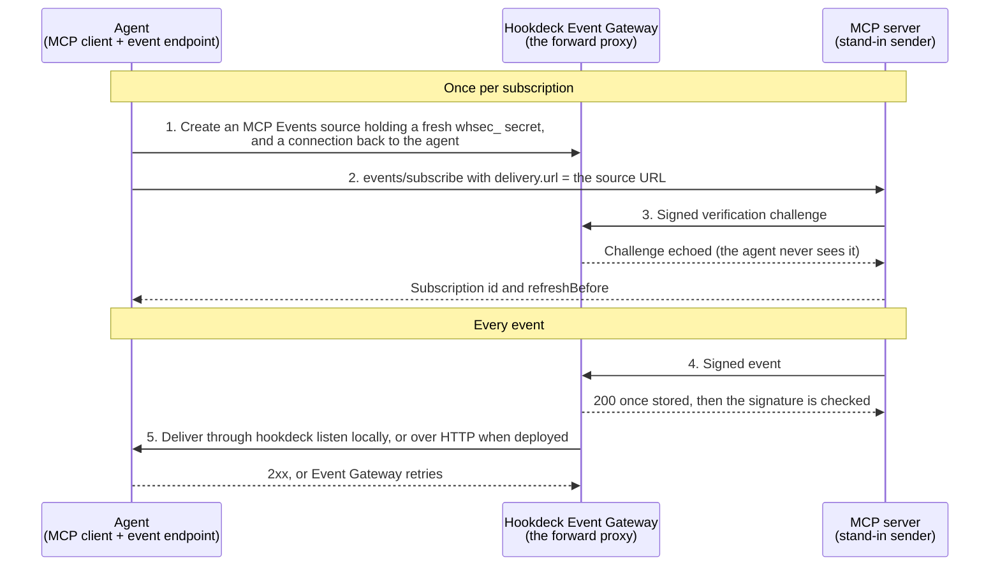

# Receive MCP Events with Event Gateway as a forward proxy

**Status:** demo code, not production-ready. Verified on 2026-10-08 and 2026-10-09 against a dedicated Event Gateway test project: locally through `hookdeck listen`, deployed on Fly.io, and with two different MCP servers sending. See [What's verified](#whats-verified) and [Known limits](#known-limits). [docs/PLAN.md](docs/PLAN.md) has the full proposal and the detailed results.

[MCP Events](https://github.com/modelcontextprotocol/modelcontextprotocol/pull/3415) (SEP-3415, a draft MCP extension) lets an agent subscribe to events an MCP server offers. In webhook mode the server POSTs each event to a callback URL the agent chose. The SEP describes a common deployment where that URL belongs to a **forward proxy** that receives webhooks on the agent's behalf.

This demo uses Hookdeck Event Gateway as that proxy:



1. **The agent owns the proxy.** For each subscription it creates an `MCP Events` source holding a fresh `whsec_` secret, plus a connection to itself with a deduplicate rule on `headers.webhook-id` and a retry rule. It's one source per subscription because a source holds one secret.
2. **It subscribes with the source URL** as its callback. The MCP server doesn't know there's a proxy.
3. **Event Gateway answers the verification challenge** on the agent's behalf, because the source holds the subscription's secret.
4. **Event Gateway stores every event** before answering `200`, so the MCP server never sees the agent's downtime as delivery failures. It then verifies the Standard Webhooks signature, and a badly signed event is never delivered.
5. **Event Gateway delivers to the agent:** through `hookdeck listen` on localhost, or over HTTP to a deployed agent. It deduplicates on `webhook-id` and retries while the agent is down.

The agent refreshes its subscription before it expires, and on exit unsubscribes and deletes its source and connection. Started with `--keep`, it leaves them in place instead: the MCP server keeps delivering, Event Gateway keeps storing, and the next start picks the same source back up and recovers what it missed.

## What's in here

| Path | What it is |
|---|---|
| `src/sender/` | A stand-in MCP server that sends MCP Events (`incident.created`). It plays the part of any third-party MCP server. For a production-grade sender, see [hookdeck/mcp-events-outpost-demo](https://github.com/hookdeck/mcp-events-outpost-demo). |
| `src/agent/` | The agent: an MCP client plus the event endpoint Event Gateway delivers to. `proxy.ts` sets up the forward proxy in Event Gateway, and `recover.ts` recovers deliveries `hookdeck listen` missed. |
| `scripts/` | Open incidents, inspect or break the agent, clean up. |
| `docs/PLAN.md` | The proposal: background on the SEP, who does what, design decisions, status and remaining work. |

## Run it locally

Prerequisites: Node.js 22 or later, and a **dedicated** Event Gateway project (the agent creates and deletes sources and connections in it).

```bash
npm install
cp .env.example .env   # add HOOKDECK_API_KEY; set SENDER_TOKEN and AGENT_TOKEN to random strings
```

In one terminal, start the stand-in sender:

```bash
npm run sender
```

In a second terminal, start the agent. With no `AGENT_PUBLIC_URL`, it receives through `hookdeck listen` (the CLI is a dependency, logged in with its own config under `run/`):

```bash
npm run agent
```

The agent logs the source it created, `hookdeck listen` connecting, and the subscription. The sender logs the challenge being answered by Event Gateway.

In a third terminal:

```bash
npm run emit -- --severity P1 --title "Database connection pool exhausted"
npm run emit -- --duplicate        # same webhook-id twice, re-signed: handled once
npm run emit -- --bad-signature    # rejected by Event Gateway, never reaches the agent
npm run agent:fail                 # the agent answers 503 to every delivery
npm run emit                       # Event Gateway holds the event and retries
npm run agent:fail -- --off        # delivered on the next retry
npm run agent:status               # subscription, counters, handled events
```

Take `hookdeck listen` down and bring it back:

```bash
npm run agent:listen -- stop       # a clean stop: Event Gateway stores requests but creates no events
npm run emit
npm run agent:listen -- start      # the agent retries the stored request and handles the event

npm run agent:listen -- kill       # a crash: events are created, attempts fail until listen is back
npm run emit
npm run agent:listen -- start      # within a few minutes, the retry rule delivers it
```

To run every scenario and get pass or fail with evidence (the subscription, a delivery, a duplicate, a bad signature, the agent down then back, `listen` stopped and killed in CLI mode, and, when deployed, a forged request refused):

```bash
npm run scenarios
```

Press Ctrl+C in the agent's terminal to unsubscribe and delete its source and connection. If an agent was killed without cleaning up, `npm run teardown` removes what it left.

### Restart without losing events

```bash
npm run agent -- --keep            # Ctrl+C now keeps the subscription, source and connection
npm run emit                       # while the agent is stopped: stored by Event Gateway
npm run agent -- --keep            # picks up the same source and recovers the event
```

On start, and whenever `listen` comes back, the agent recovers in `src/agent/recover.ts`:

1. **Requests with no event** (ignored as `CLI_DISCONNECTED`, after a clean stop or more than about 2 minutes down): retried, scoped to the agent's connection. Retry rather than replay, because a second retry of the same request is refused, so running recovery twice can't deliver twice.
2. **Events that settled as `FAILED`** (`listen` crashed and the retry rule ran out): retried, unless the agent answered `4xx`.
3. **Events still queued or between automatic retries:** left alone. A `FAILED` event with `next_attempt_at` set still has a retry scheduled, and a manual retry then delivers it twice.

It repeats every 60 s until a later pass finds nothing to do, for up to 5 minutes, because the API can show a delivered event as missing or queued for 30 s or more.

### Against another MCP server

The agent isn't tied to the stand-in sender. It expects an MCP server on protocol `2026-07-28` (it reads `server/discover`) that offers the event with webhook delivery, and it has been run unchanged against the [Outpost demo's](https://github.com/hookdeck/mcp-events-outpost-demo) server. With that server running locally:

```bash
SENDER_MCP_URL=http://localhost:3000/mcp SENDER_TOKEN=dev-token-alice \
  AGENT_EVENT=order.created AGENT_ARGUMENTS='{"minTotal":100,"currency":"USD"}' \
  npm run agent
```

Then place orders with `npm run order` in the Outpost demo. Outpost filters by the subscription's arguments and delivers to the agent's source. `npm run emit` and `npm run scenarios` drive the stand-in sender only.

## Deploy to Fly.io

The deployed agent receives over HTTP at its public URL, and checks Event Gateway's `x-hookdeck-signature` with the project's signing secret.

```bash
fly apps create <sender-app> && fly apps create <agent-app>   # then set the app names and URLs in fly.*.toml
fly secrets set -c fly.sender.toml SENDER_TOKEN=...
fly secrets set -c fly.agent.toml HOOKDECK_API_KEY=... HOOKDECK_SIGNING_SECRET=... AGENT_TOKEN=... SENDER_TOKEN=...
fly deploy -c fly.sender.toml --ha=false
fly deploy -c fly.agent.toml --ha=false
```

Point the scripts at the deployed services with `SENDER_MCP_URL=https://<sender-app>.fly.dev/mcp` and `AGENT_URL=https://<agent-app>.fly.dev`. For example, `SENDER_MCP_URL=... AGENT_URL=... npm run scenarios`.

## How Event Gateway covers the receiver's duties

SEP-3415 puts these duties on whatever receives the webhook. Here that's the `MCP Events` source and its connection, so the agent doesn't implement them.

| Receiver duty in SEP-3415 | Event Gateway | Verified |
|---|---|---|
| Consent: answer the verification challenge | Answered at the source, only when correctly signed. Not forwarded to the agent, which SEP-3415 allows since `c47fd24` | Yes |
| Verify the Standard Webhooks signature (MUST) | Verified on the source. A badly signed delivery is stored and marked `VERIFICATION_FAILED`, never delivered, but answered `200` (see [Known limits](#known-limits)) | Yes |
| Deduplicate on `webhook-id` (SHOULD) | A deduplicate rule on `headers.webhook-id`, window up to 1 hour | Yes, including a sender's re-signed retry |
| Don't count the client's downtime against the sender | Every request is stored before Event Gateway answers, then retried to the agent | Yes: the agent answered `503` and the sender saw one `200` |
| Reject stale timestamps (SHOULD) | Checked on the challenge only, not when a request carrying an event arrives. A stored delivery is forwarded with its original `webhook-timestamp`, so the agent re-checks the signature without the 5-minute window. Nothing in this setup rejects a stale event (see [Known limits](#known-limits)) | No, a gap |
| Forward `gap` and `terminated` envelopes (MUST) | Forwarded like events | Yes |
| `503` or `425` for an unknown subscription ID | Doesn't arise: one source per subscription | n/a |

## What's verified

| Scenario | Local, `hookdeck listen` | Deployed, HTTP | Outpost demo as sender |
|---|---|---|---|
| Agent creates its source; Event Gateway answers the sender's challenge | Yes | Yes | Yes |
| An event is delivered and handled | Yes, attempt 1 | Yes, attempt 1, about 1 s | Yes, attempt 1, about 1 s |
| The sender's filter applied (Outpost filters by subscription arguments) | n/a | n/a | Yes |
| Duplicate `webhook-id`, re-signed: handled once | Yes | Yes | Not run |
| Badly signed delivery never reaches the agent | Yes | Yes | Not run |
| Agent answers `503`, then recovers; the sender sees one `200` | Yes | Yes | Yes |
| A forged request sent straight to the agent is refused (`401`) | n/a | Yes | n/a |
| Subscription refreshed before `refreshBefore` | Not observed | Yes, for over 20 hours | Not observed |
| `listen` stopped cleanly; recovery retries the request | Yes | n/a | Yes |
| `listen` killed; the retry rule delivers once it's back | Yes | n/a | Not run |
| `listen` killed until retries ran out; recovery retries the event | Yes, by hand | n/a | Not run |
| Agent restarted with `--keep`; recovery picks up what it missed | Yes, by hand | n/a | Not run |
| Ctrl+C unsubscribes and deletes the source and connection | Yes | n/a | Yes |

`npm run scenarios` covers the stand-in sender rows that aren't marked "by hand": 7 of 7 locally, 6 of 6 deployed.

**Not verified:**

- **Other MCP servers.** Both senders follow OpenAI's MCP Events profile, which ChatGPT-facing servers use today: a top-level `capabilities.events`, the design sketch's error codes (such as `-32015` for a callback endpoint error), and `{}` for unsubscribing an unknown subscription. SEP-3415 as written declares the capability under `capabilities.extensions["io.modelcontextprotocol/events"]`, uses `-32023` to `-32027`, and returns NotFound. The agent checks only the top-level capability, so it would refuse a server that follows SEP-3415 to the letter.
- **Secret rotation,** which isn't built.
- **A refresh in CLI mode.** The local runs ended before `refreshBefore`; the deployed agent refreshes on the same code path.

## Known limits

- **The agent needs code to set up its proxy.** SEP-3415 says the client registers its secret with the proxy but not how, so an MCP client uses Event Gateway this way only with code like `src/agent/proxy.ts`.
- **The agent holds the project's API key,** which can create and delete any source and connection in the project. That suits an agent you deploy and run yourself, not a client you ship to other people.
- **One source per subscription.** SEP-3415 also describes one receiver for many subscriptions that looks up each secret by `X-MCP-Subscription-Id`. A source holds one secret, so that isn't possible on Event Gateway today, and every subscribe and exit makes Event Gateway API calls.
- **No freshness check on events.** Event Gateway checks `webhook-timestamp` on the challenge only, and the agent skips the 5-minute window because Event Gateway's retries carry the original timestamp. A copy of a validly signed delivery sent again after the 1-hour deduplicate window would be delivered, and only the agent's record of handled `eventId`s stops it, which is in memory (below). Found by reading the setup, not tested.
- **The agent remembers handled events in memory,** so a redelivery after a restart is handled again. A real agent would store `eventId`s it has handled.
- **The CLI path is for local development.** `hookdeck listen` is a development tool, and it isn't durable while disconnected, so the agent has to recover. After a clean stop, or about 2 minutes after a crash, no event is created and the request is stored for the agent to retry. In between, an event is created but only the retry rule delivers it. Pausing the connection doesn't help after a clean stop. Measured with `hookdeck-cli` 3.1.0; see [docs/PLAN.md](docs/PLAN.md#phase-2-cli-destination-to-a-local-agent).
- **`hookdeck listen` restarts for each new source,** because a running `listen` doesn't pick up sources created after it started ([hookdeck-cli#467](https://github.com/hookdeck/hookdeck-cli/issues/467)). The agent restarts it.
- **A badly signed delivery is answered `200`.** Event Gateway stores every request before verifying it, so the sender can't tell a rejected delivery from an accepted one, and a conformance checker that grades by status code marks those cases as failed. The rejection shows in the request log as `VERIFICATION_FAILED`.
- **No secret overlap on a source during rotation.** The sender dual-signs for a grace window, but a source holds one secret.
- **The stand-in sender** keeps subscriptions in memory, checks callback URLs only for `https`, and uses a static bearer token instead of OAuth.
