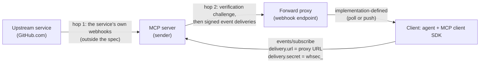
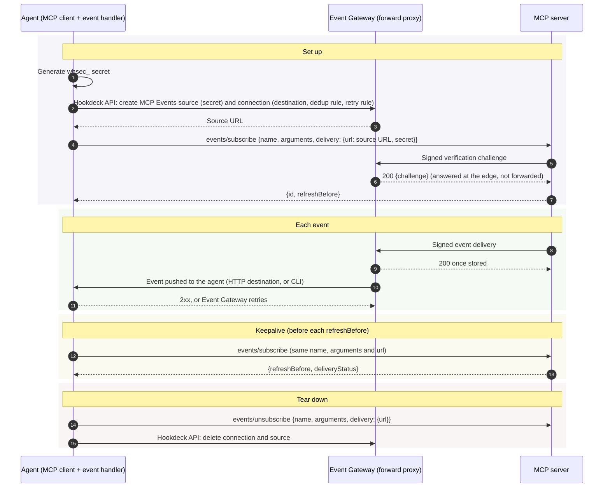
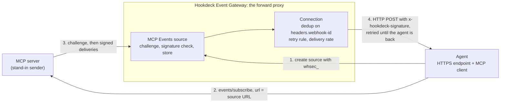

# Proposal: Event Gateway as an MCP Events forward proxy

Status: in progress, paused on 2026-10-08 while related Event Gateway changes for MCP Events handshakes are finished. Phase 1 and the core of Phase 2 are built and verified; see [Status](#status-2026-10-08) for what's done and what's next.

## Summary

| | |
|---|---|
| **Proposal** | A demo of Hookdeck Event Gateway acting as the forward proxy that MCP Events describes for webhook delivery. Phase 1 delivers to the agent's HTTP endpoint, including a deployed agent. Phase 2 delivers to a local agent through the Hookdeck CLI. Afterward, share the results with the MCP Triggers & Events working group as a field report. |
| **Why** | SEP-3415 calls a forward proxy "a common deployment" for webhook delivery. The only receiver-side implementation reported to the working group so far is evdock, a self-hosted relay published on 2026-10-06. Event Gateway already does what the SEP asks of a receiver (consent, verification, dedup, storing before `2xx`) and adds what a tunnel doesn't (queueing, retries with backoff, rate limits, replay). |
| **What's new for local agents** | The SEP assumes a client behind NAT polls. Event Gateway with the CLI gives that client push delivery while the MCP server stays in webhook mode. |
| **Risk** | The CLI path isn't durable while `hookdeck listen` is disconnected. After a clean stop, or about 2 minutes after a crash, no event is created; the request is stored, and the agent has to retry it to create the event. Within those 2 minutes an event is created but only the retry rule gets it to the next session. The demo's agent recovers both on start, but that's a product gap (CLI destinations should queue like HTTP destinations), and the demo has to say so. |
| **Next steps** | See [Remaining work](#remaining-work-in-order). |

## Status (2026-10-08)

### Built

- **Stand-in sender** (`src/sender/`): an MCP server offering `incident.created` (optional `minSeverity` argument) over Streamable HTTP, protocol `2026-07-28`, following OpenAI's MCP Events profile (top-level `capabilities.events`, `-32015`, idempotent unsubscribe). Challenge before activation, TTL grants with a sweeper, dual-signing on secret rotation, Standard Webhooks signing on every attempt, bounded retries (no retry on `410`/`413`), and demo options to send a duplicate or a badly signed delivery.
- **Agent** (`src/agent/`): an MCP client that owns its forward proxy. Per subscription it creates an `MCP Events` source with a fresh `whsec_` secret and a connection (dedup rule on `headers.webhook-id`, linear retry rule), subscribes with the source URL, refreshes before `refreshBefore`, and on exit unsubscribes and deletes the source and connection. All Event Gateway calls go through `src/agent/proxy.ts`.
  - **CLI mode** (default locally): the connection has a CLI destination and the agent supervises `hookdeck listen`, logged in with its own config under `run/`.
  - **Restart and recovery:** with `--keep`, the agent leaves its subscription, source and connection in place on exit. On start it picks up the endpoint made for the same subscription (reading the secret back with `GET /sources/{id}?include=config.auth`), re-subscribes with the same URL and secret, and runs recovery (`src/agent/recover.ts`): it retries `CLI_DISCONNECTED` requests scoped to its connection, retries events that settled as `FAILED` (not on a `4xx`), and leaves anything queued or scheduled to Event Gateway. It repeats every 60 s until a later pass finds nothing, for up to 5 minutes. The same recovery runs when `listen` is brought back with `npm run agent:listen -- start`.
  - **HTTP mode** (`AGENT_PUBLIC_URL` set, used on Fly.io): the connection has an HTTP destination, and the agent checks `x-hookdeck-signature` with the project's signing secret.
  - **The event endpoint** re-checks the MCP server's Standard Webhooks signature without the 5-minute window, handles each `eventId` once, ignores `verification` bodies, and answers `503` for an unknown subscription ID.
- **Scripts:** `npm run emit`, `npm run agent:status`, `npm run agent:fail`, `npm run agent:listen` (stop, kill or start `listen`), `npm run teardown`, and `npm run scenarios`, which runs the verified table below against a running sender and agent and prints pass or fail with evidence (7 of 7 locally in CLI mode; 6 of 6 against the deployed services, where the two `listen` cases don't apply).
- **Deployment:** `Dockerfile`, `fly.sender.toml`, `fly.agent.toml`. Both services were deployed on Fly.io (apps `mcp-events-receive-sender` and `mcp-events-receive-agent`, region `ams`).

### Verified

Against a dedicated Event Gateway test project, 2026-10-08.

| Scenario | Local, CLI destination | Deployed, HTTP destination |
|---|---|---|
| Agent creates the source and connection; the sender's challenge is answered by Event Gateway | Yes | Yes |
| Normal event | Handled, attempt 1 | Handled, attempt 1, about 1 s |
| Duplicate (same `webhook-id`, re-signed) | Second request ignored by the dedup rule; handled once | Same |
| Badly signed delivery | `VERIFICATION_FAILED`, no event; sender saw `200` | Same |
| Forged request sent straight to the agent | n/a | `401` (no valid `x-hookdeck-signature`) |
| Agent answers `503`, then recovers | Retried every 15 s; handled on attempt 3; sender saw one `200` | Handled on attempt 4; sender saw one `200` |
| Refresh before `refreshBefore` | Not observed | Yes, with `deliveryStatus` from the sender |
| Ctrl+C: unsubscribe, stop `listen`, delete source and connection | Yes | n/a |
| `listen` stopped cleanly, event sent, `listen` back | Request ignored as `CLI_DISCONNECTED`; the agent's recovery retried it; handled once | n/a |
| `listen` killed, event sent, `listen` back 30 s later | Event created; attempts 1 and 2 failed `CLI_UNAVAILABLE`; the retry rule delivered attempt 3; recovery left it alone; handled once | n/a |
| `listen` killed until the retry rule ran out (about 3.5 minutes) | All 11 attempts failed `CLI_UNAVAILABLE` and the event settled `FAILED`; recovery retried it on reconnect; handled once, attempt 12 | n/a |
| Agent stopped with `--keep`, two events sent, agent restarted | Picked up the same source and subscription; both requests `CLI_DISCONNECTED`; recovery retried both; each handled once | n/a |

Also verified (R1, R6): evdock's receiver checker grades an `MCP Events` source MUST 6/10 because it grades by status code; every MUST case it fails is rejected by Event Gateway as `VERIFICATION_FAILED` but answered `200`. Dedup on `headers.webhook-id` absorbs replays and re-signed retries.

**Observed once, not reproduced:** in one early run through the CLI destination, three events waited 75 to 101 s before their first attempt, with no failed attempt recorded, and each was delivered once. In 7 controlled runs afterwards (23 timed events, fresh and reused sources, CLI configs and sessions, the same timing), every event arrived 0.2 to 0.5 s after it was sent. The hold was on the platform side before the first attempt, so the demo treats it as an intermittent delivery delay, not a CLI behavior. Recovery doesn't treat a `QUEUED` event as missed, so a delay like it can't cause a duplicate.

### Changes from the plan

- **Setup uses the REST API, not the CLI,** so per-subscription secrets never appear on a command line and the deployed agent doesn't need the CLI. The CLI is used only for `listen`.
- **No third-party tunnel.** Local development uses the Hookdeck CLI (Phase 2's path); the HTTP destination path is tested deployed on Fly.io.
- **The forward-proxy question is answered:** the SEP's author confirmed a proxy needn't forward the `verification` envelope (see Spec feedback).
- **Event Gateway's handling of MCP Events handshakes is being refined.** Re-run R1 and the handshake checks before publishing results.

### Remaining work, in order

1. ~~**R4**~~ done: the CLI cases are measured (see Phase 2), and the 75 s hold didn't reproduce.
2. ~~**Recovery on agent start**~~ done, with the two `listen` cases in `npm run scenarios`.
3. ~~**Scenarios script**~~ done: `npm run scenarios`.
4. **Redeploy the agent** to Fly.io with the recovery and naming changes, and re-run the scenarios deployed.
5. **README** completed from the verified results. The stub folder `hookdeck/mcp-events-outpost/` and the repo README rows are done.
6. **One run against the Outpost demo's MCP server** as a real second sender.
7. **Phase 3:** the evdock spike.
8. **Field report drafts** in `docs/`, after Phase 2.

## Background

**Terminology.** The SEP calls the MCP server's POST to the callback URL a "delivery". In Event Gateway terms that POST is a **request** to a source; a **delivery** is Event Gateway sending an event on to its destination (here, the agent). This proposal uses the SEP's word when quoting it or describing the MCP server, and the Event Gateway words for what Event Gateway does with the POST.

### MCP Events

MCP Events is a draft extension to the Model Context Protocol (MCP). It lets an agent subscribe to events an MCP server offers, such as a new order or a failed build, so the agent can act with no user present.

- **Status:** a formal proposal, [SEP-3415: Events Extension](https://github.com/modelcontextprotocol/modelcontextprotocol/pull/3415), opened 2026-10-05, draft and unmerged (head `c47fd24` as of 2026-10-08). It grew out of the MCP Triggers & Events working group's [design sketch](https://github.com/modelcontextprotocol/experimental-ext-triggers-events/blob/main/docs/design-sketch-proposal.md). Quotes in this proposal are from the SEP.
- **Roles:** the MCP server (sender) lists event types with `events/list` and accepts subscriptions. The client (an agent and its MCP client) calls `events/subscribe` with a callback URL and a signing secret it chose.
- **Delivery modes:** poll, push (`events/stream`) and webhook. This demo is about webhook mode.
- **Webhook delivery** is [Standard Webhooks](https://www.standardwebhooks.com/) signing plus an `X-MCP-Subscription-Id` header, a verification challenge before the first delivery, and subscriptions that expire unless the client refreshes them. Retries are bounded (3 to 5 attempts over 10 to 15 minutes in the guidance), and `410` and `413` must not be retried.
- **Adoption:** ChatGPT supports webhook mode as a client since 2026-09-29 ([OpenAI's guide](https://developers.openai.com/plugins/build/mcp-events)). ChatGPT uses its own receiver, so it can't be pointed at a forward proxy, and it isn't the subscriber in this demo.

### The forward proxy in the SEP

> The callback URL does not need to be the client itself. A common deployment is a forward proxy that receives webhooks and serves events to clients by poll or push:
>
> `Upstream → MCP Server → webhook POST → Forward Proxy ← Client (poll or push)`



What the SEP asks of each party:

- **Client SDK:** "generates a `whsec_` secret, registers it (or its derivation input) with the gateway, and then calls `events/subscribe` with `delivery: {url, secret}`", refreshes before `refreshBefore`, and unsubscribes when done. The client, not the proxy, holds the MCP session with the server.
- **MCP server:** sends a signed verification challenge before delivering anything, then POSTs each event with Standard Webhooks headers plus `X-MCP-Subscription-Id`. Each retry "MUST regenerate the timestamp and signature"; `webhook-id` stays the same. It "MAY suspend delivery" after sustained failure, for example "a delivery failure rate above 95% over a rolling 60-minute window".
- **Forward proxy:**
  - consents to delivery by echoing the challenge (or by an allowlist, out-of-band confirmation or a well-known document);
  - "MUST verify the signature"; "SHOULD reject deliveries whose `webhook-timestamp` is more than 5 minutes old"; "SHOULD deduplicate on `webhook-id`";
  - "SHOULD return a retryable status (`503` or `425 Too Early`)" for a subscription it can't route yet;
  - must make `cursor` and `eventId` available to the client, and must forward control envelopes (`gap`, `terminated`) to it;
  - can present the public endpoint that "terminates HMAC, and re-authenticates to downstream services with whatever mechanism the internal network requires".

On local clients, the SEP says "a client behind NAT cannot receive webhooks", and that poll "works … for clients behind NAT with no public endpoint".

### Who does what

The forward proxy belongs to the client. The SEP's client SDK guidance: "The SDK generates a `whsec_` secret, registers it (or its derivation input) with the gateway, and then calls `events/subscribe` with `delivery: {url, secret}`."

- **The MCP server doesn't know there's a proxy.** It receives a callback URL and a secret in `events/subscribe`, checks the URL, sends the challenge and signs deliveries, exactly as it would for an agent's own endpoint.
- **The proxy never speaks MCP.** It receives webhooks for subscriptions the client set up, and hands events to the client.
- **The client talks to both.** It speaks MCP to the server (subscribe, refresh, unsubscribe) and uses the proxy's own API to manage what the proxy receives and where it sends it. In this demo the client is the agent, and the proxy's API is the Hookdeck API.

| Concern | MCP server | Forward proxy (Event Gateway) | Client (the agent) |
|---|---|---|---|
| Choose the signing secret | Validates its format | Holds it (on the source) | Generates it |
| Callback URL | Validates it (public HTTPS, no redirects) | Provides it (the source URL) | Creates the source, passes the URL to the server |
| Verification challenge | Sends it, checks the echo | Answers it | Nothing to do |
| Signing deliveries | Signs every attempt | Verifies, dedupes, stores | Optionally re-verifies what the proxy forwards |
| Getting events to the agent | Delivers to the callback URL | Pushes (HTTP or CLI destination) or serves them for polling | Exposes an endpoint, runs `hookdeck listen`, or polls |
| Retries | Retries non-`2xx` within its window | Answers once stored; retries its own delivery to the agent | Returns `2xx` once it has handled the event |
| Subscription lifetime | Grants a TTL, expires unrefreshed subscriptions | Unaware of TTLs | Refreshes before `refreshBefore`, unsubscribes when done |
| Secret rotation | Dual-signs for a short grace window | Needs the new secret (and ideally the old one) | Updates the source, then refreshes with the new secret |
| Teardown | Deletes the subscription on unsubscribe or expiry | Unaware | Unsubscribes, then deletes the source and connection |

The whole lifecycle, with Event Gateway as the proxy:



Rotating the secret adds two steps to a keepalive: update the source's secret through the Hookdeck API, then refresh with the new secret. Until a source can hold the old and new secret together, deliveries signed with only the old secret in between fail verification.

Refreshing never involves the proxy. It's a call from the client to the MCP server, and the server doesn't challenge the URL again, because verification is cached per `(principal, url)`.

### What the SEP specifies and what it leaves open

The SEP specifies the wire between the MCP server and the webhook endpoint (subscribe, the challenge, signed deliveries, refresh, unsubscribe). It doesn't specify anything between the client and the forward proxy.

| | Specified | Left open |
|---|---|---|
| MCP server ↔ endpoint | The challenge and its echo, Standard Webhooks signing, `X-MCP-Subscription-Id`, retry and status-code semantics, control envelopes | |
| Client ↔ MCP server | `events/subscribe`, refresh, `events/unsubscribe`, `refreshBefore`, `deliveryStatus` | |
| Client registers a secret with the proxy | That it happens: the SDK "registers it (or its derivation input) with the gateway" | How: no API, no format. "Derivation input" suggests the proxy could derive per-subscription secrets from a shared key instead of storing each one |
| Client learns the callback URL | The SDK sketch takes one static URL: `WebhookConfig(url="https://proxy.example.com/hooks/client123")`, with an optional `secret_provider` | How a client gets a URL per subscription, which one source per subscription needs |
| Proxy routes to a subscription | The receiver "looks up the secret by `X-MCP-Subscription-Id`"; a delivery for an ID it hasn't "been told to route" gets `503` or `425` | How the proxy is told the ID once `events/subscribe` returns |
| Proxy hands events to the client | "implementation-defined, e.g. poll/push" | Everything: protocol, acknowledgement, cursor handling |
| Proxy forwards control envelopes | It MUST, "by the same channel it forwards events" | Whether `verification` is exempt when the proxy answers it |

So this demo's client-to-proxy side (create a source per subscription through the Hookdeck API, deliver through a connection, delete on unsubscribe) is one valid implementation, not a protocol. Two consequences:

- **SDKs need a hook to provision a URL per subscription.** The SEP's `WebhookConfig` takes a static URL and a `secret_provider`. An `endpoint_provider` (given the subscription key and secret, return a URL) would let an SDK work with Event Gateway, evdock's per-path URLs, or any proxy that issues a URL per subscription. Worth raising in the field report.
- **A standard client-to-proxy registration API is a possible future spec item,** not something this demo should invent. The demo keeps that step in one module so it's easy to swap out.

### How this differs from the bridge

[hookdeck/mcp-events-bridge](https://github.com/hookdeck/mcp-events-bridge) already gives local agents a callback URL per subscription through Event Gateway and the Hookdeck CLI, via its `create_tunnel_url` MCP tool. Event Gateway answers the challenge, and deliveries reach `localhost` through `hookdeck listen`. But a bridge tunnel URL "only accepts deliveries signed by the bridge": the bridge is the sender as well, so its URLs are a proxy for its own events only. Because it's the sender, it also re-sends missed deliveries with a fresh signature, which avoids the 5-minute window problem.

This demo is the general case: a proxy any MCP server can deliver to, provisioned by the client, with the subscriber's own secret on the source.

### Event Gateway's `MCP Events` source type

Event Gateway added an `MCP Events` source type on 2026-10-06. It's a webhook source with Standard Webhooks verification and one required `whsec_` secret, plus the MCP Events handshake:

- **The challenge is answered at the edge,** and only when it's signed with the source's secret. An unsigned or wrongly signed challenge isn't echoed, so an MCP server can't point a subscription at someone else's source.
- **The handshake never becomes an event,** so it doesn't reach a destination or appear in request logs.
- **Requests carrying events are verified** with the Standard Webhooks verifier. A request that fails is rejected as `VERIFICATION_FAILED` and creates no event, and the MCP server still gets a `2xx`.
- **Freshness** is checked on the challenge, which is answered synchronously. It isn't checked on requests carrying events, because Event Gateway re-verifies stored requests when they're retried.
- **Dedup** isn't built into the source type. The recommendation is a deduplicate rule on `headers.webhook-id` on the connection.

### One source per subscription

The demo creates one `MCP Events` source per subscription, with that subscription's secret.

- **Why it's valid:** the client supplies a secret on each `events/subscribe`, and the callback URL is part of the subscription's identity, `(principal, delivery.url, name, arguments)`. The SEP includes `X-MCP-Subscription-Id` so a receiver *can* pick a secret from it; it doesn't require one URL to serve many subscriptions.
- **Why it works with the handshake:** the source exists, with its secret, before `events/subscribe` is called, so the challenge verifies and the `503`/`425` race can't happen.
- **Isolation:** each MCP server gets its own secret, and a refresh with a new secret touches only that subscription's source.
- **Costs:** a source and a connection per subscription, and, for the CLI path, a `hookdeck listen` restart for each new source until [hookdeck-cli#467](https://github.com/hookdeck/hookdeck-cli/issues/467).

| Approach | Valid against the SEP? | Trade-offs |
|---|---|---|
| One source per subscription | Yes | More resources; a `listen` restart per new source (CLI path) |
| One source and one secret shared across subscriptions, routed by `X-MCP-Subscription-Id` | Yes, the SEP doesn't require distinct secrets | Every MCP server holds the same secret, so one could sign deliveries that verify as another's; a refresh with a new secret moves every subscription |
| One source, a secret per subscription looked up by `X-MCP-Subscription-Id` | Yes, it's the model the header exists for. Since `c47fd24` the SEP spells out the first challenge: the receiver tries the registered secrets that have no ID yet, echoes if one verifies, and may bind the ID then | Not possible on Event Gateway today, since a source holds one secret. Accepting any registered secret on the challenge also lets one sender's secret answer for another's subscription until the ID is bound |

### How Event Gateway fills the forward proxy role

| SEP duty | Event Gateway |
|---|---|
| "Registers the secret with the gateway" | Create the `MCP Events` source with the subscription's `whsec_` secret |
| Callback URL | The source URL, `https://hkdk.events/<id>` |
| Consent | Challenge answered at the edge, only when correctly signed |
| Verify (MUST) | Standard Webhooks verification on the source |
| Freshness (SHOULD) | On the challenge; not on re-verified stored requests |
| Dedup on `webhook-id` (SHOULD) | A deduplicate rule on `headers.webhook-id`, window 1 second to 1 hour |
| Store before `2xx` | Every request is stored before Event Gateway responds, so the agent's downtime never counts toward the sender's suspension threshold |
| `503`/`425` for an unknown subscription | Doesn't arise with one source per subscription |
| Pass `cursor` and `eventId` on | The body is forwarded unchanged (to verify, R5) |
| Forward control envelopes (MUST) | `gap` and `terminated` are forwarded like events; `verification` is answered and not forwarded (see Spec feedback) |
| Re-authenticate downstream | Destination auth on an HTTP destination |
| Serve events to the client | Phase 1: HTTP destination. Phase 2: CLI destination. Poll through the API: research only |

## What the demo must show

1. **The challenge answered by Event Gateway,** with the agent never seeing it.
2. **Signature verification:** a delivery signed with the wrong secret is rejected.
3. **Dedup on `headers.webhook-id`:** a sender's retry (same `webhook-id`, fresh timestamp and signature) reaches the agent once.
4. **Events held while the agent is down** and delivered when it's back, while the sender sees only `2xx`.
5. **A deployed agent:** the MCP client and its endpoint run on a public host, not only locally through a tunnel.
6. **Local development with the Hookdeck CLI.**

Also in scope:

- **A stub folder** `hookdeck/mcp-events-outpost/` with a short README linking [hookdeck/mcp-events-outpost-demo](https://github.com/hookdeck/mcp-events-outpost-demo), the sending side built on Outpost, so both sides show side by side. A stub rather than a git submodule, which would pin an old commit and clone empty.
- **Repo README rows** for both folders.
- **README known limits:** a `listen` restart per new source until hookdeck-cli#467; no secret overlap on a source during rotation; the CLI queueing gap.

This demo lives in `hookdeck-demos` because it demonstrates a Hookdeck feature. The Outpost demo (a reference implementation of the MCP Events server side) and [hookdeck/mcp-events-bridge](https://github.com/hookdeck/mcp-events-bridge) (a tool that turns providers' webhooks into MCP Events) stand on their own, so they have their own repos.

Out of scope: poll and push delivery modes on the sender, building secret rotation (documented as a limit), OAuth on the stand-in sender.

## Phase 1: HTTP destination

Event Gateway POSTs each verified event to the agent's HTTPS endpoint. This is the deployment the SEP describes: a proxy that stays up, stores before acknowledging, and hands events on.



What Event Gateway adds over the agent receiving directly ([destinations](https://hookdeck.com/docs/destinations), [retries](https://hookdeck.com/docs/retries)):

- **Queue and retries:** a retry rule per connection (linear or exponential, a configurable interval, up to 50 automatic attempts, chosen status codes, `Retry-After` honored), plus manual and bulk retry.
- **Delivery control:** a delivery timeout (60 seconds by default, up to 900), a max delivery rate per destination (events beyond it wait as pending), and pausing a connection (held events deliver on unpause).
- **Authentication to the agent:** the agent verifies Event Gateway's `x-hookdeck-signature` with the project's signing secret. Bearer token or API key destination auth are alternatives.
- **Observability:** every request, event and attempt is stored and searchable.

**Development and deployment:**

- **Development:** a tunnel to the local agent, as the Outpost demo does with a `cloudflared` quick tunnel.
- **Deployed:** the agent (MCP client plus HTTP endpoint plus refresh loop) deploys to Fly.io as a long-running Node service, and the demo is tested deployed. A long-running process fits the refresh loop better than a serverless function, which would need a scheduler.
- **The sender must be reachable from the deployed agent,** because the agent calls `events/subscribe` on it. So the stand-in sender deploys too, as a separate service.

## Phase 2: CLI destination to a local agent

`hookdeck listen` holds an outbound WebSocket to Event Gateway, and the CLI makes an HTTP request to the agent on `localhost`. The agent needs no public endpoint, and the MCP server stays in webhook mode.

| Approach for a local agent | How events arrive | While the agent is offline |
|---|---|---|
| Poll (the SEP's answer for NAT) | The client calls `events/poll` on the server | Nothing is pushed; the server must keep events for replay |
| A plain tunnel (ngrok, cloudflared) | The server's POST passes through to `localhost` | The POST fails; the server retries within its window, then may suspend |
| evdock (daemon plus relay) | The daemon fetches from its relay every 5 seconds | The relay stores deliveries until the daemon fetches them |
| Event Gateway plus CLI | Pushed through `listen`'s WebSocket to `localhost` | Retried while `listen` is connected; requests stored once it isn't (below) |

What the CLI does today, measured with `hookdeck-cli` 3.1.0 against an `MCP Events` source (R4, 2026-10-08):

1. **`listen` connected, agent down:** the retry rule applies, as for any destination. An agent answering `503` was retried every 15 s and delivered on attempt 4. A refused connection is recorded as a `500` attempt, not a CLI error code.
2. **`listen` dropped abnormally (killed, or the network lost):** for about 2 minutes Event Gateway still creates an event, but events aren't held: the attempt fails with `CLI_UNAVAILABLE` about 10 s after the request arrives. The connection's retry rule delivers it to a reconnected `listen` while retries remain. Once they run out, the event settles as `FAILED` and needs an event retry. The [CLI docs](https://hookdeck.com/docs/cli) describe this window as holding events "as pending", which isn't what 3.1.0 does.
3. **`listen` stopped cleanly, or gone more than about 2 minutes:** no event is created. Event Gateway still ingests and stores the request, recorded as ignored with cause `CLI_DISCONNECTED`, and nothing is delivered when `listen` reconnects. Retrying the request creates the event and delivers it ([requests](https://hookdeck.com/docs/requests)). Replay does too, on a new request, but leaves the original marked `CLI_DISCONNECTED`, so a recovery that runs again finds it again. A second retry of the same request is refused with `400`, so the agent uses retry.
4. **Pausing the connection** holds events only while a session exists: connected, or inside the 2-minute window after a crash. Held events deliver 6 to 7 s after unpause, to a new session if `listen` restarted. A request that arrives after a clean stop is `CLI_DISCONNECTED` even while the connection is paused, so pausing before a planned stop doesn't avoid recovery.

Two details recovery depends on:

- **`FAILED` isn't always settled.** Between automatic retries an event shows `FAILED` with `next_attempt_at` set. A manual retry at that point delivers it, and the scheduled retry still fires afterward: two deliveries. Settled means `SUCCESSFUL`, `CANCELLED`, or `FAILED` with no `next_attempt_at`.
- **A request's `events_count` doesn't include CLI events;** they're counted in `cli_events_count`. And the API can show a delivered event as missing or `QUEUED` for 30 s or more, so recovery repeats rather than deciding on one look.

The demo's agent runs recovery after `listen` connects, on start and whenever `listen` comes back: retry each `CLI_DISCONNECTED` request scoped to its connection, retry each settled `FAILED` event unless the agent answered `4xx`, and leave the rest to Event Gateway.

**Product gap: CLI destinations should queue.** A CLI destination should hold events while no session is attached and deliver them when one connects, as an HTTP destination does when its endpoint is down. Today a client has to know to run recovery for cases 2 and 3, and to tell a settled `FAILED` event from one between retries.

## Alternatives

Checked 2026-10-08. This is what searches found, not a complete survey.

- **[evdock](https://github.com/loveaihq/evdock)** (MIT, public since 2026-10-06): a self-hosted daemon plus optional relay (Cloudflare Worker or Node) for agents not on the public internet, with a receiver conformance checker and a mock MCP Events server. The relay holds no secrets; the local daemon verifies, dedupes and stores in SQLite, and can wake an agent command. Reported to the working group as [field report #10](https://github.com/modelcontextprotocol/experimental-ext-triggers-events/issues/10). Of everything found, it's the closest to a forward proxy implementation.
- **Plain tunnels** (ngrok, cloudflared): make a local agent reachable, with no storage, verification or retries of their own.
- **Svix:** a ["What is an MCP webhook?"](https://www.svix.com/resources/glossary/mcp-webhook/) page (updated 2026-10-05) suggests Svix Ingest as a gateway that stores webhooks for an MCP server to poll. It doesn't mention MCP Events or a forward proxy.
- **Metorial:** [Callbacks](https://metorial.com/changelog/2025-10-callbacks) forward providers' webhooks to agents, which is closer to a bridge than to an MCP Events forward proxy.

No other product presented as an MCP Events forward proxy turned up.

## Who sends MCP Events today

- **Well-known hosted MCP servers:** `github/github-mcp-server`, `getsentry/sentry-mcp` and `makenotion/notion-mcp-server` have no `events/subscribe` (code search, 2026-10-08).
- **Inline** ([inline-chat/inline](https://github.com/inline-chat/inline), MCP server at `mcp.inline.chat`): a team chat product whose hosted MCP server sends webhook-mode MCP Events (18 event types, such as `message.created`) to public HTTPS callbacks, with the challenge and Standard Webhooks signing. Needs an Inline account and OAuth. Not tried.
- **Frameworks:** `vercel-labs/mcp-handler` (`experimental_registerMcpEvents`) and `alpic-ai/skybridge` register the Events methods.

So the demo uses two senders:

- **A stand-in sender built into the demo:** small, no accounts needed, and the one the scenarios run against.
- **The [Outpost demo](https://github.com/hookdeck/mcp-events-outpost-demo)'s MCP server,** for one documented run: a full MCP Events implementation, tested end to end with ChatGPT, delivering through Hookdeck Outpost. It authenticates with bearer tokens, so the agent can subscribe to it without OAuth.

Inline would show a third-party hosted sender, but it needs an Inline account and an MCP OAuth flow in the agent, so it's out of scope for now.

## Sharing results with the working group

The working group asks for implementation evidence. Its [CONTRIBUTING](https://github.com/modelcontextprotocol/experimental-ext-triggers-events/blob/main/CONTRIBUTING.md) asks findings to "include enough detail for others to reproduce or evaluate", "note which clients, servers, and transports were tested", and "be explicit about what worked, what didn't, and what remains untested". Implementers post these as field reports in [experimental-ext-triggers-events](https://github.com/modelcontextprotocol/experimental-ext-triggers-events/issues) (five so far). Discussion happens mostly in the group's Discord channel and weekly working session.

There's also a gap a forward proxy can help with: the client conformance work ([conformance#540](https://github.com/modelcontextprotocol/conformance/issues/540)) leaves out "the receiver obligations (signature verification, the timestamp window, dedup on `webhook-id`) for now".

Plan, after Phase 2:

1. **Decide the position on local delivery first.** A CLI-based path is one of several ways to push to a NAT'd client (tunnels, relays like evdock, an outbound connection to a gateway). The report could cover it as a general pattern, or leave it out.
2. **One or two field reports,** depending on that position:
   - **Hosted forward proxy:** Event Gateway against each receiver obligation, evdock's checker results, what's untested, and the spec feedback below.
   - **Push to clients behind NAT in webhook mode:** if there's a general point to make about the SEP's delivery-mode trade-offs, separate from any product.
3. **Discord:** a short note linking the report, and an offer to walk through it in a working session.
4. **Conformance:** offer an `MCP Events` source as a live target for receiver scenarios, coordinating with the existing conformance and evdock work rather than starting a parallel suite.

The reports state Hookdeck's affiliation and are implementation feedback. They're drafted in `docs/` and reviewed before anything is posted.

### Spec feedback to verify during the build

- **The verification envelope and "forward control envelopes" (MUST):** a proxy that answers the challenge on the client's behalf doesn't forward it. Should the SEP exempt `verification`? Asked in the working group's Discord channel on 2026-10-08. **Answered the same day:** the SEP's author said forwarding is unnecessary, and SEP-3415 changed accordingly (commit `c47fd24`): "A `verification` envelope is consumed by the endpoint itself, which answers it in the HTTP response, and is not forwarded. The client learns the outcome from the `events/subscribe` result." Event Gateway answers the challenge without forwarding it, which matches. The demo's agent still ignores any `verification` body it receives.
- **Store-and-forward and the 5-minute window:** a proxy re-delivers the stored request with its original `webhook-timestamp`, so a client that re-checks freshness rejects anything held more than 5 minutes. evdock's report raises the same point. The SEP could say the proxy checks freshness on receipt.
- **NAT'd clients and webhook mode:** with a forward proxy that holds an outbound connection to the client, a client behind NAT can receive webhook-mode deliveries.
- **One proxy URL per subscription:** valid, and it avoids the `503`/`425` race and the secret lookup. The SEP could say so.
- **Secret rotation at a proxy:** the sender dual-signs only "for a short grace window", so a proxy needs to accept the old and new secret together for that window.
- **Status codes from a store-and-forward proxy:** the SEP says the receiver "MUST verify the signature before processing" but doesn't say what it returns when verification fails. A proxy that acknowledges on storage returns `2xx` either way, so the sender's `deliveryStatus` stays healthy even if every delivery fails verification (for example after the secrets drift apart), and status-code-based conformance checks can't tell a correct rejection from acceptance.

## Research

All live checks run against a dedicated Event Gateway test project (`HOOKDECK_API_KEY` in `.env`).

- **R1. Conformance (done 2026-10-08):** evdock's receiver checker (at `213d08b`) against fresh `MCP Events` sources, with and without the dedup rule. The checker grades by HTTP status code: MUST 6/10 both times. Every MUST case it graded as failed (a bad signature, each missing Standard Webhooks header) was rejected by Event Gateway as `VERIFICATION_FAILED`, but answered `200`, because the edge verifies the challenge and core verifies deliveries after storing them. The challenge itself is answered `200` with the echo when correctly signed, even immediately after the source is created, and `401` otherwise. With the dedup rule, a replay and a re-signed retry of the same `webhook-id` each produced one event. `gap` and `terminated` envelopes are forwarded as events.
- **R2. Wire format:** SEP-3415 versus OpenAI's guide. Known differences: the capability under `capabilities.extensions["io.modelcontextprotocol/events"]` versus a top-level `capabilities.events`; error codes `-32023` to `-32027` versus the design sketch's `-32011` to `-32015` (OpenAI's guide uses at least `-32015`); unsubscribe of an unknown subscription returns NotFound versus `{}`. Lean: the stand-in sender follows OpenAI's profile, as ChatGPT-facing servers do today, with the differences in the README.
- **R3. Setup:** create an `MCP_EVENTS` source with a `whsec_` secret, an HTTP or CLI destination, and the dedup and retry rules, through the CLI (`hookdeck gateway connection upsert`) or the API.
- **R4. Agent down, both phases (done 2026-10-08):** an HTTP destination down then back; the four CLI cases, including retrying and replaying a `CLI_DISCONNECTED` request for an `MCP Events` source, and which one recovery should use. Results are in Phase 2: recovery uses request retry, retries only settled `FAILED` events, and never acts on a queued or scheduled one.
- **R5. What reaches the agent:** body and headers unchanged; what a retried or replayed delivery carries (the original `webhook-timestamp`). Lean: the agent verifies `x-hookdeck-signature` (an HMAC of the body with the project's signing secret, with no timestamp, so retries and replays verify), re-checks the Standard Webhooks signature without the timestamp window, and handles each `eventId` once.
- **R6. Dedup:** two requests with the same `webhook-id` but a fresh timestamp and signature produce one event; a replay or manual retry isn't blocked.
- **R7. Tooling:** `hookdeck-cli` version and the minimum for `MCP_EVENTS`; MCP SDK v2 against TypeScript `^5.9`; signal handling in the npm shim ([hookdeck-cli#429](https://github.com/hookdeck/hookdeck-cli/issues/429)).
- **R8. Deployment:** Fly.io, as [hookdeck/mcp-events-bridge](https://github.com/hookdeck/mcp-events-bridge) does: a `Dockerfile` and a `fly.toml` per service, always-on machines with a health check, and secrets set with `fly secrets set`.

## Build

### Layout

```
hookdeck/mcp-events-receive/
  README.md              topology, run steps, scenarios, known limits, verified vs assumed
  docs/PLAN.md           this proposal
  docs/FIELD-REPORT*.md  field report drafts, reviewed before posting
  .env.example           HOOKDECK_API_KEY, HOOKDECK_SIGNING_SECRET, AGENT_PUBLIC_URL, ports
  src/sender/            stand-in MCP server: events/list, subscribe (with challenge), unsubscribe, signed delivery
  src/agent/             agent: MCP client, per-subscription source and connection, HTTP handler, listen supervisor, recovery
  src/shared/            Standard Webhooks helpers and secret generation (adapted from the Outpost demo)
  scripts/               emit an event, run scenarios, teardown
hookdeck/mcp-events-outpost/
  README.md              stub linking hookdeck/mcp-events-outpost-demo
```

### Phase 1 steps

1. Scaffold to match this repo's recent demos (ESM, `tsx`, `typescript ^5.9`, `npm run typecheck`).
2. **Stand-in sender:** one event type; `events/subscribe` runs the challenge, returns `id` and `refreshBefore`; deliveries signed with the `standardwebhooks` library, retried a few times, every response code logged; `--duplicate` and `--bad-signature` options.
3. **Agent:** per subscription, generate a `whsec_` secret, create the source and a connection to its own HTTP endpoint (dedup rule, retry rule), then call `events/subscribe` with the source URL. Verify `x-hookdeck-signature` on deliveries. Refresh before `refreshBefore`; unsubscribe deletes the connection and source.
4. **Scenarios,** run locally through a tunnel: subscribe and challenge, deliver, bad signature, duplicate, agent down then back, unsubscribe and teardown.
5. **Deploy** the agent and the sender to Fly.io, and run the same scenarios against the deployed services.

### Phase 2 steps

6. Add a CLI mode: the connection uses a CLI destination, and a supervisor runs `hookdeck listen` (restarted when a source is added, logged).
7. Recovery on agent start: retry `CLI_DISCONNECTED` requests and retry settled `FAILED` events for this agent's connections. Done.
8. Scenarios for the CLI cases: `listen` stopped cleanly and killed are in `npm run scenarios`; retries running out and the agent restarted with `--keep` were run by hand (see Status).

### Phase 3 (spike): evdock with Event Gateway as its relay

evdock's daemon is a ready-made local client: it subscribes, refreshes, verifies, stores and wakes an agent. A spike checks whether it can receive through an `MCP Events` source and `hookdeck listen` instead of its own relay (`--callback-base` set to the source URL). Two evdock changes look necessary: accepting a secret the source already holds, rather than generating one inside `subscribe`, and tolerating deliveries Event Gateway holds for more than 5 minutes. Any change goes to evdock as an upstream proposal, not a fork.

### Then

9. README, stub folder, repo README rows.
10. Field report drafts.

Checks before each commit: `npm run typecheck`; scenarios pass; changed Mermaid diagrams rendered; no names of individuals, no internal links; no em dashes; small commits on a branch; no push or PR without approval.

## Open questions

1. **Status code when a request fails verification:** if Event Gateway answers `401` for a request to an `MCP Events` source that fails verification, as it does for the challenge, the demo and the field report describe that. If it stays `200`, both explain why and point the checker's users to the request log.
2. **The checker and store-and-forward receivers:** whether to propose a proxy-aware grading mode to evdock and the working group's receiver conformance work, and when relative to the field report.

## Measures of success

- **Demo:** scenarios pass locally and deployed, and the README separates what was verified from what was assumed.
- **Conformance:** evdock's checker results for an `MCP Events` source, every MUST passing or explained.
- **Working group:** the field report gets a response on any of the group's channels (an issue reply, a mention in meeting notes, a conformance follow-up). None of the field reports filed so far has a reply in the repo itself, so this isn't something the demo controls.
