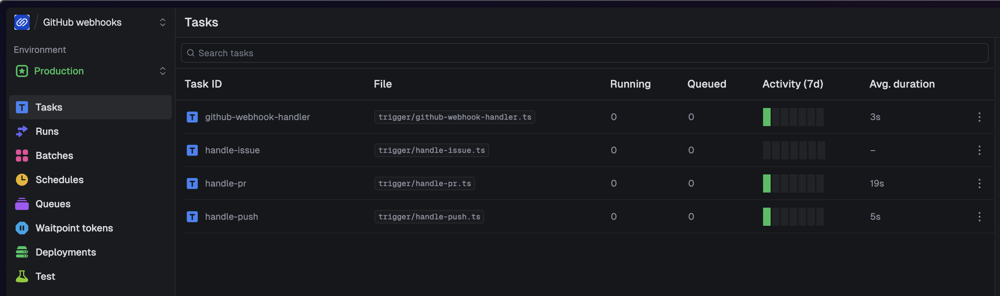
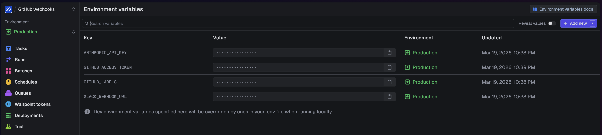
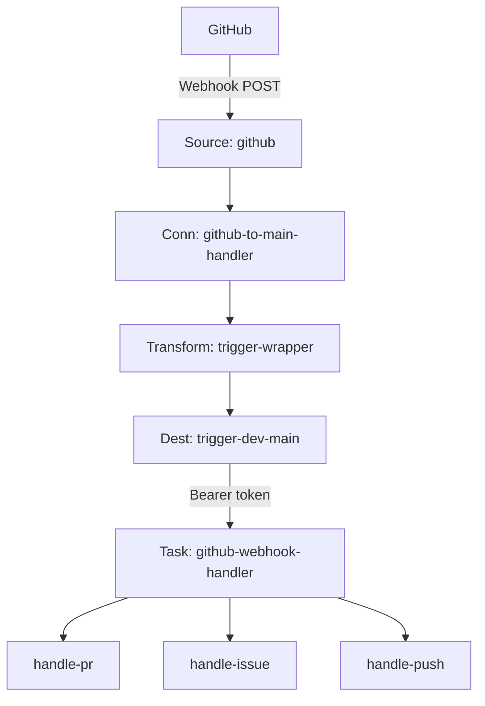
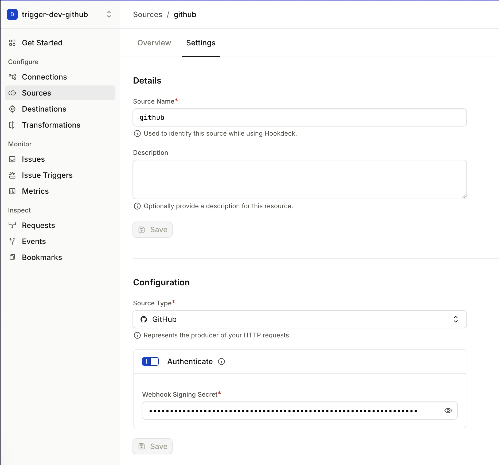
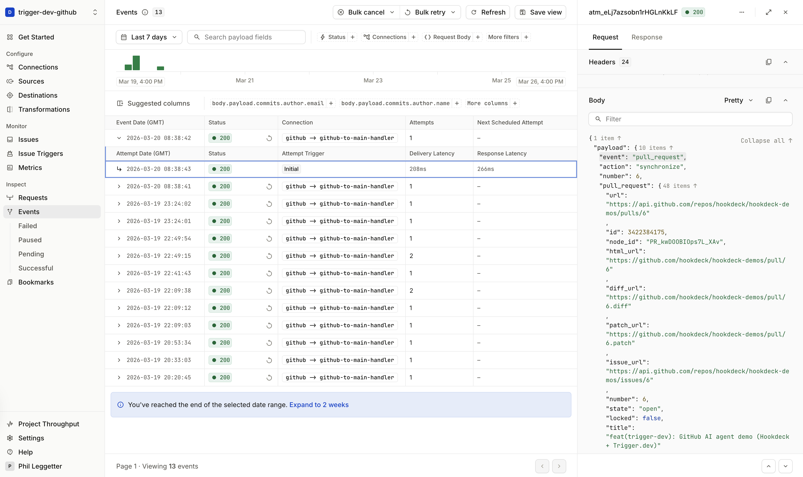
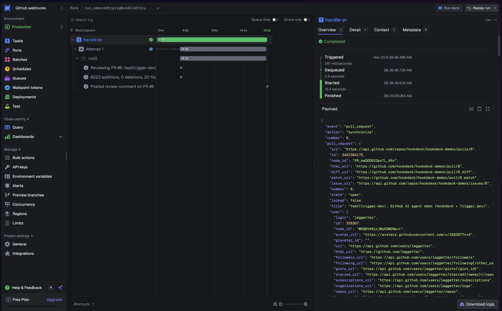
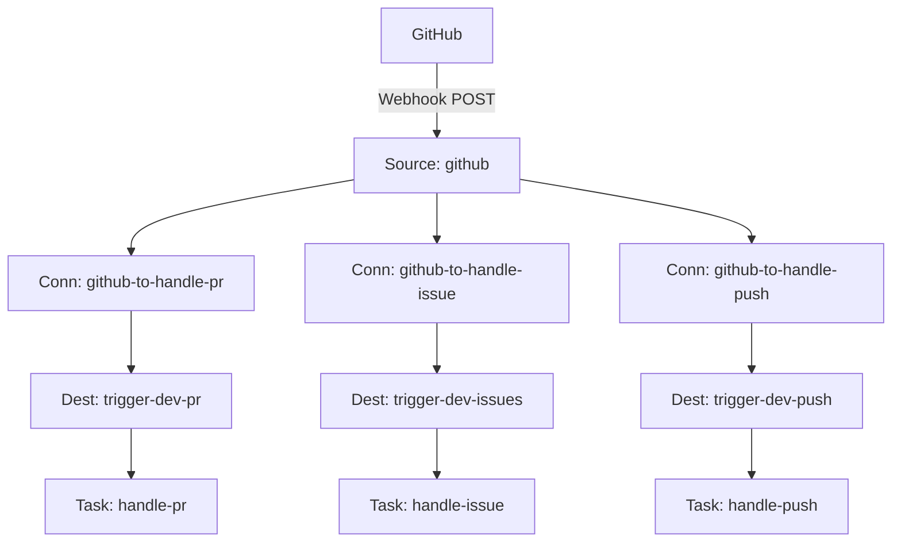
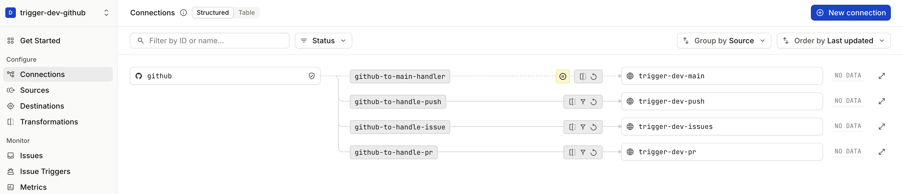
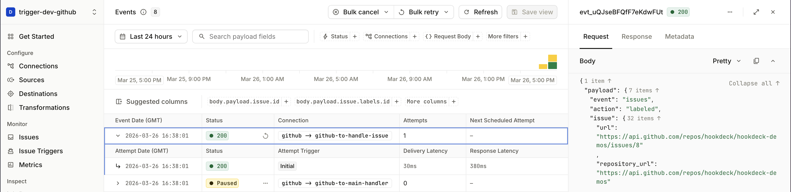
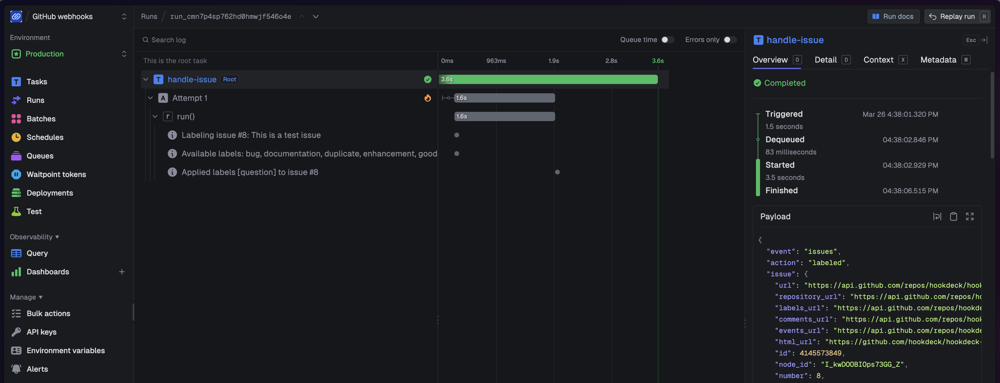

# Reliable GitHub automation: Hookdeck, Trigger.dev, and Claude

GitHub fires webhooks for pull requests, issues, and pushes — but turning those into reliable, AI-powered automation means handling signature verification, retries, payload transformation, routing, and durable task execution. That is a lot of infrastructure for what should be application logic.

[Hookdeck](https://hookdeck.com) and [Trigger.dev](https://trigger.dev) split that problem cleanly. Hookdeck is the webhook edge: it accepts GitHub’s signed webhooks, verifies them, transforms payloads, retries failed deliveries, and gives you full observability over every event. Trigger.dev is the task runtime: it runs durable tasks with automatic retries, typed payloads, and a dashboard that traces every step of execution. Together, they let you focus on application logic. In this tutorial, that means three [Claude](https://www.anthropic.com/claude)-powered automations: PR code reviews, issue labeling, and deployment summaries posted to [Slack](https://slack.com).

You will build the integration step by step: deploy Trigger.dev tasks, wire Hookdeck to deliver GitHub events, register the webhook, and trigger real activity on your repo. You will start with a **Trigger.dev task router** — one Hookdeck [connection](https://hookdeck.com/docs/connections) delivering every event to a single router task that fans out to child tasks in code. Once that works, you will level up to **Hookdeck connection routing** — separate Hookdeck connections with header filters so each event type is delivered straight to the right task, with routing managed at the edge rather than in code.

**What you will have by the end:**

- A GitHub webhook reliably delivering events through Hookdeck to Trigger.dev
- An AI-powered PR reviewer, issue labeler, and push-to-Slack summarizer — all running as durable Trigger.dev tasks
- Understanding of two routing patterns and when each fits
- Full observability in both the [Hookdeck dashboard](https://dashboard.hookdeck.com) and [Trigger.dev dashboard](https://cloud.trigger.dev)

See the [Hookdeck documentation](https://hookdeck.com/docs) and [Trigger.dev documentation](https://trigger.dev/docs) for deeper reference.

> **Quick path — skip the walk-through**
>
> ```bash
> git clone https://github.com/hookdeck/hookdeck-demos.git
> cd hookdeck-demos/trigger-dev/github-ai-agent
> npm install
> npm run setup
> ```
>
> The setup script walks you through `.env` configuration, deploys to Trigger.dev, creates Hookdeck connections, and registers the GitHub webhook. Once it finishes, open an issue, a pull request, and push a branch on your repo to exercise the tasks. Inspect runs in the [Hookdeck dashboard](https://dashboard.hookdeck.com) and [Trigger.dev dashboard](https://cloud.trigger.dev).

---

## Architecture overview

Every path in this tutorial starts the same way: GitHub posts a signed webhook to a [Hookdeck source](https://hookdeck.com/docs/sources) URL. Hookdeck verifies the signature, transforms the payload, and delivers it to a [Trigger.dev HTTP trigger](https://trigger.dev/docs/triggers/http) URL with Bearer authentication. Trigger.dev runs the task durably — with automatic retries and full run tracing.

> **Why Hookdeck in front of Trigger.dev:** [Trigger.dev HTTP triggers](https://trigger.dev/docs/triggers/http) are authenticated HTTPS endpoints on Trigger's API (Bearer token). Webhook providers like GitHub sign requests with their own scheme (HMAC) and post to a URL they configure. Without a gateway, you would run your own server to accept the POST, verify the signature, reshape the body, and forward to Trigger with the Bearer token. Hookdeck replaces that hop — it exposes the ingress URL, verifies the sender, transforms the payload, and delivers to Trigger with authentication, plus retries, queues, and observability.

### Services and roles

- [GitHub](https://github.com) — Sends signed webhooks (`pull_request`, `issues`, `push`) to the Hookdeck source URL.
- [Hookdeck](https://hookdeck.com) — Accepts webhooks, verifies the sender (GitHub HMAC), applies [transforms](https://hookdeck.com/docs/transformations) and filters, retries failed deliveries, and delivers to destinations. Full event observability in the [dashboard](https://dashboard.hookdeck.com).
- [Trigger.dev](https://trigger.dev) — Runs durable tasks with automatic retries, typed payloads, fan-out via `tasks.trigger()`, and a [run dashboard](https://cloud.trigger.dev) that traces each step of execution.
- [Anthropic](https://www.anthropic.com) (Claude) — Powers code review summarization and issue classification inside the tasks (currently using `claude-sonnet-4-20250514`).
- [Slack](https://slack.com) (optional) — Receives deployment summaries via an [incoming webhook](https://api.slack.com/messaging/webhooks) when `SLACK_WEBHOOK_URL` is set.

### Two routing patterns

This tutorial covers two ways to route events from the shared Hookdeck source to Trigger.dev tasks. With a **Trigger.dev task router**, a single Hookdeck connection delivers all events to one router task, which inspects the event type and fans out to child tasks in code. With **Hookdeck connection routing**, separate Hookdeck connections use header filters to deliver each event type directly to the matching task — routing happens at the edge, not in code. Both patterns use the same source, transform, and tasks; only the fan-out point differs. You will build the [task router](#triggerdev-task-router) first, then [scale up to connection routing](#scaling-up-hookdeck-connection-routing).

---

## Prerequisites

- [Hookdeck](https://hookdeck.com) account and project API key (from the dashboard under project settings)
- [Trigger.dev](https://trigger.dev) account and project; this demo uses a [Production environment API key](https://trigger.dev/docs/apikeys) (`tr_prod_…`)
- [GitHub](https://github.com) repository you control (admin access to **Settings → Webhooks**)
- [GitHub CLI](https://cli.github.com/) (`gh`) installed and authenticated (`gh auth login`); the tutorial registers the webhook via `gh` to stay CLI-first (alternatively you can use the GitHub UI — see [Register the GitHub webhook](#2-register-the-github-webhook))
- [Node.js](https://nodejs.org/) 18+
- [Hookdeck CLI](https://hookdeck.com/docs/cli) v2.0.0+
- [Anthropic API key](https://console.anthropic.com/settings/keys)
- Optional: [Slack incoming webhook](https://api.slack.com/messaging/webhooks) for push summaries

---

## Get the code

```bash
git clone https://github.com/hookdeck/hookdeck-demos.git
cd hookdeck-demos/trigger-dev/github-ai-agent
npm install
```

> **URL note:** If the repository location changes, adjust the clone URL to match the canonical hookdeck-demos (or successor) path; the tutorial assumes this directory layout.

---

## Project layout

Here is what you cloned. The tutorial follows data through these files.

```
trigger.config.ts             — Trigger.dev project config; syncs env vars to Production on deploy
trigger/
  github-webhook-handler.ts   — Task router: reads event type, dispatches to child tasks
  handle-pr.ts                — PR review: fetches diff, asks Claude, posts comment
  handle-issue.ts             — Issue labeler: classifies with Claude, applies labels
  handle-push.ts              — Push summary: synthesizes commits, posts to Slack
  lib/
    ai.ts                     — Claude calls via the Anthropic SDK
    github.ts                 — GitHub API helpers (diffs, comments, labels)
    slack.ts                  — Slack incoming webhook with console fallback
hookdeck/
  trigger-wrapper.js          — Hookdeck transform: wraps payload for Trigger.dev, extracts event type
scripts/
  setup.sh                    — Interactive setup (env, deploy, Hookdeck + GitHub resources)
  setup-hookdeck.sh           — Idempotent Hookdeck connection creation (both routing patterns)
  setup-github-webhook.sh     — GitHub webhook registration via gh CLI
```

---

## Configure environment variables

Copy the example file and edit values in your editor. Gather API keys and refs from the [Hookdeck dashboard](https://dashboard.hookdeck.com), [Trigger.dev dashboard](https://cloud.trigger.dev), [GitHub](https://github.com/settings/tokens), and [Anthropic console](https://console.anthropic.com).

```bash
cp .env.example .env
```

Fill every variable below (comments match `.env.example`).

Hookdeck

| Variable                | Description                                                                            |
| ----------------------- | -------------------------------------------------------------------------------------- |
| `HOOKDECK_API_KEY`      | Project API key from Hookdeck **Dashboard → Project Settings → API Keys**.             |
| `GITHUB_WEBHOOK_SECRET` | Shared secret GitHub uses for HMAC signing; must match the secret on the repo webhook. |

Trigger.dev (this demo uses Production only)

| Variable              | Description                                                                                          |
| --------------------- | ---------------------------------------------------------------------------------------------------- |
| `TRIGGER_SECRET_KEY`  | Production secret (`tr_prod_…`). Hookdeck sends this as a Bearer token to Trigger.dev HTTP triggers. |
| `TRIGGER_PROJECT_REF` | Project ref from Trigger.dev (e.g. `proj_xxxx`).                                                     |

GitHub (tasks and webhook script)

| Variable              | Description                                                       |
| --------------------- | ----------------------------------------------------------------- |
| `GITHUB_REPO`         | Target repo, e.g. `hookdeck/hookdeck-demos`.                      |
| `GITHUB_ACCESS_TOKEN` | Personal access token with `repo` scope for API calls from tasks. |
| `GITHUB_LABELS`       | Optional CSV of allowed labels for the issue labeler.             |

Anthropic

| Variable            | Description                 |
| ------------------- | --------------------------- |
| `ANTHROPIC_API_KEY` | From the Anthropic console. |

Slack (optional)

| Variable            | Description                                                                  |
| ------------------- | ---------------------------------------------------------------------------- |
| `SLACK_WEBHOOK_URL` | Incoming webhook URL; if unset, push summaries may only log to the task run. |

Optional behavior

| Variable                                  | Description                                                                                                                                   |
| ----------------------------------------- | --------------------------------------------------------------------------------------------------------------------------------------------- |
| `GITHUB_PUSH_SUMMARY_DEFAULT_BRANCH_ONLY` | If `true`, push summaries only for the repo default branch; if unset or `false`, any branch can trigger the Slack summary (useful for demos). |

---

## Deploy Trigger.dev tasks (before Hookdeck)

Hookdeck destinations need stable HTTP trigger URLs to deliver to, so deploy tasks first. See [Trigger.dev deployment](https://trigger.dev/docs/deployment/overview).

From the project root:

```bash
npm run deploy
```

This runs `trigger.dev deploy --env prod` with `--env-file .env`. Trigger.dev deploys your task code **and** syncs environment variables to Production in one step — `trigger.config.ts` declares which keys to sync (`ANTHROPIC_API_KEY`, `GITHUB_ACCESS_TOKEN`, `GITHUB_LABELS`, `SLACK_WEBHOOK_URL`), so you do not need to set them separately in the Trigger.dev dashboard.

After deploying, open the [Trigger.dev dashboard](https://cloud.trigger.dev) and confirm you see four tasks in your **Production** environment: `github-webhook-handler`, `handle-pr`, `handle-issue`, and `handle-push`. Each task has a stable HTTP trigger URL that Hookdeck will deliver to.





---

## Trigger.dev task router

One Hookdeck connection delivers all GitHub events to a single router task, which fans out to child tasks in code.



**GitHub** posts to the **Hookdeck source**, which verifies the HMAC signature. A single connection (`github-to-main-handler`) applies the **trigger-wrapper transform** (reshapes the payload for Trigger.dev) and delivers to the **trigger-dev-main destination** with your Trigger.dev Bearer token. The **github-webhook-handler** task reads the event type and dispatches to the appropriate child task (`handle-pr`, `handle-issue`, or `handle-push`) using `tasks.trigger()`.

Do not create the three filtered Hookdeck-routed connections yet — this keeps routing unambiguous while you learn the router path.

### 1. Create the Hookdeck connection

Load your `.env` variables into the shell, authenticate the Hookdeck CLI, and read the transformation code:

```bash
set -a && source .env && set +a

hookdeck ci --api-key "$HOOKDECK_API_KEY"

TRANSFORM_CODE=$(cat hookdeck/trigger-wrapper.js)
```

`hookdeck ci` binds the CLI to the specific project that owns the API key. Alternatively, `hookdeck login` opens an interactive browser flow that authenticates your full account and lets you navigate across all your projects — see the [CLI docs](https://hookdeck.com/docs/cli).

Now create the single task router connection with `connection upsert`. See the [Hookdeck CLI](https://hookdeck.com/docs/cli) and [`connection` command](https://hookdeck.com/docs/cli/connection.md) for flags.

```bash
TRIGGER_BASE_URL="https://api.trigger.dev/api/v1/tasks"

hookdeck gateway connection upsert "github-to-main-handler" \
  --source-name "github" \
  --source-type GITHUB \
  --source-webhook-secret "$GITHUB_WEBHOOK_SECRET" \
  --source-allowed-http-methods "POST" \
  --destination-name "trigger-dev-main" \
  --destination-type HTTP \
  --destination-url "$TRIGGER_BASE_URL/github-webhook-handler/trigger" \
  --destination-auth-method bearer \
  --destination-bearer-token "$TRIGGER_SECRET_KEY" \
  --rule-transform-name "trigger-wrapper" \
  --rule-transform-code "$TRANSFORM_CODE" \
  --rule-retry-count 5 \
  --rule-retry-strategy linear \
  --rule-retry-interval 60000
```

Copy the source URL from the CLI output (for example `Source URL: https://hkdk.events/...`). You will paste it into GitHub in the next step.

If you plan to use the optional `gh` script below, you can save the URL to `.hookdeck-source-url` on one line (the script reads this file):

```bash
echo 'https://hkdk.events/YOUR_SOURCE_ID' > .hookdeck-source-url
```

### Why source verification matters

Look at the `--source-type GITHUB` and `--source-webhook-secret` flags in the command you just ran. These are critical.

The Hookdeck source URL is public — anyone who discovers it could POST a payload. Without source verification, Hookdeck would accept that request, transform it, and deliver it to Trigger.dev using your Bearer token. The task would run on attacker-supplied data.

With `--source-type GITHUB` and `--source-webhook-secret` set, Hookdeck verifies GitHub's HMAC signature on every inbound request. Requests with invalid or missing signatures are rejected before they reach the transform or any destination.

The verification chain has two layers: Hookdeck verifies the GitHub signature at the source (proving the webhook came from GitHub), and Trigger.dev requires a valid Bearer token on every delivery (proving the request came from an authorized caller — here, Hookdeck). Together, these ensure that only legitimate GitHub events reach your tasks.



### What the transform does

The `--rule-transform-name "trigger-wrapper"` flag attached a transform to this connection. `hookdeck/trigger-wrapper.js` runs inside Hookdeck on every event and bridges the format gap between what GitHub sends and what Trigger.dev expects.

**What GitHub sends** (simplified):

```json
// Headers: X-GitHub-Event: pull_request, X-Hub-Signature-256: sha256=...
{
  "action": "opened",
  "pull_request": { "number": 42, "title": "Add feature X", "..." : "..." }
}
```

**What Trigger.dev receives** (after the transform wraps the payload):

```json
{
  "payload": {
    "event": "pull_request",
    "action": "opened",
    "pull_request": { "number": 42, "title": "Add feature X", "..." : "..." }
  }
}
```

The transform wraps the original body inside `{ payload: { ... } }` (the shape Trigger.dev HTTP triggers expect) and extracts the `X-GitHub-Event` header into an `event` field so task code can branch on event type. The transform runs inside Hookdeck — no server to deploy — and the source code lives in the repo at `hookdeck/trigger-wrapper.js`, versioned alongside your task code.

### 2. Register the GitHub webhook

Point your repository’s webhook at the Hookdeck source URL. You can do this with the GitHub CLI or through the GitHub UI.

**Option A — GitHub CLI (`gh`)**

Run the following in the same terminal where you loaded your `.env` variables (or ensure `GITHUB_REPO`, `GITHUB_WEBHOOK_SECRET`, and the Hookdeck source URL are set).

```bash
HOOKDECK_SOURCE_URL=$(cat .hookdeck-source-url)

gh api "repos/$GITHUB_REPO/hooks" \
  --method POST \
  -f "name=web" \
  -f "config[url]=$HOOKDECK_SOURCE_URL" \
  -f "config[content_type]=json" \
  -f "config[secret]=$GITHUB_WEBHOOK_SECRET" \
  -f "events[]=pull_request" \
  -f "events[]=issues" \
  -f "events[]=push" \
  -F "active=true"
```

This creates a webhook on `$GITHUB_REPO` that sends `pull_request`, `issues`, and `push` events to your Hookdeck source URL, signed with `$GITHUB_WEBHOOK_SECRET`. See [Creating webhooks](https://docs.github.com/en/webhooks/using-webhooks/creating-webhooks) and [Webhook events](https://docs.github.com/en/webhooks/webhook-events-and-payloads) in the GitHub docs.

**Option B — GitHub UI**

1. Open your repo on GitHub → **Settings** → **Webhooks** → **Add webhook**.
2. **Payload URL:** paste the Hookdeck source URL from the previous step.
3. **Content type:** `application/json`.
4. **Secret:** the same value as `GITHUB_WEBHOOK_SECRET` in your `.env` (GitHub signs deliveries with this; Hookdeck verifies using the source webhook secret).
5. **Which events:** choose **Let me select individual events** and enable at least **Issues**, **Pull requests**, and **Pushes**.
6. Save the webhook.


### 3. See the task router path in action

On the repo in `GITHUB_REPO`:

1. **Open a pull request** — expect an AI review comment from `handle-pr` (via the router).
2. **Open an issue** — expect labels from `handle-issue`.
3. **Push to a branch** — if Slack is configured, expect a summary (subject to `GITHUB_PUSH_SUMMARY_DEFAULT_BRANCH_ONLY`).

#### Trace the event through Hookdeck

Open the [Hookdeck dashboard](https://dashboard.hookdeck.com) and find the event for `github-to-main-handler`. Click into the event detail to see three things: the original GitHub payload as received, the transformed payload that was delivered to Trigger.dev (with the `event` field extracted from the header), and the delivery status (expect a 2xx response from Trigger.dev).

Now imagine that delivery had failed — a transient Trigger.dev timeout, for example. You could click **Retry** on this event and Hookdeck would re-deliver the exact same payload without GitHub needing to re-send the webhook. The original event is queued and available for replay. This is the core value of having Hookdeck at the edge: webhook providers fire once, but you get retries, replay, and full delivery history.



#### Trace the run through Trigger.dev

Open the [Trigger.dev dashboard](https://cloud.trigger.dev) and find the run for `github-webhook-handler`. Notice it spawned a child run — click into the child (for example, `handle-pr` if you opened a PR). Inside the child run, you can see each step: the Claude API call with its timing, the GitHub comment post, and the final result. If the Claude call had timed out, Trigger.dev would have retried the task automatically (up to 3 attempts with exponential backoff, as configured in `trigger.config.ts`). This is durable execution — the task runs reliably even when downstream services are flaky.



---

## Follow the data flow in code (task router)

You have seen events flow through Hookdeck and Trigger.dev in the dashboards. Now map that to the task code — starting with the router entrypoint and then the three event tasks it dispatches to.

### 1. Router entrypoint: `github-webhook-handler.ts`

This task is invoked by the task router destination URL. It reads `payload.event` and `payload.action` (set by the transform) and dispatches to the appropriate child task.

```ts
switch (payload.event) {
  case "pull_request":
    if (payload.action === "opened" || payload.action === "synchronize") {
      await tasks.trigger("handle-pr", payload);
    }
    break;

  case "issues":
    if (payload.action === "opened") {
      await tasks.trigger("handle-issue", payload);
    }
    break;

  case "push":
    await tasks.trigger("handle-push", payload);
    break;

  default:
    console.log(`Ignoring event: ${payload.event}`);
}
```

Key idea: with the task router, fan-out happens in Trigger.dev using `tasks.trigger()`. Each child task runs as an independent, durable execution — with its own retry policy, timing, and run trace in the dashboard. The router task completes immediately after dispatching; it does not wait for child tasks to finish.

### 2. Task: `handle-pr.ts` (PR review summary)

For PR events, this task fetches the PR diff, asks Claude for a concise review summary, and posts the result back to the GitHub pull request as a comment.

```ts
const diff = await getPRDiff(owner, repo, prNumber);
const review = await ask(prompt, 1500);
await postComment(owner, repo, prNumber, comment);
```

### 3. Task: `handle-issue.ts` (Issue labeler)

For newly opened issues, this task classifies the title/body into one-or-more labels using Claude, then applies those labels on GitHub.

```ts
const response = await ask(prompt, 100);
labels = JSON.parse(response.trim());
await addLabels(owner, repo, issue.number, labels);
```

### 4. Task: `handle-push.ts` (Deployment summary to Slack)

On `push`, this task synthesizes a short summary of the commits and posts it to Slack. It reads the branch name and the repository's default branch from the GitHub payload (`payload.ref` and `payload.repository.default_branch`) and can be configured to skip non-default branches.

```ts
const defaultBranchOnly =
  process.env.GITHUB_PUSH_SUMMARY_DEFAULT_BRANCH_ONLY === "true" ||
  process.env.GITHUB_PUSH_SUMMARY_DEFAULT_BRANCH_ONLY === "1";

if (defaultBranchOnly && branch !== defaultBranch) {
  return { skipped: true, branch, defaultBranch };
}

const summary = await ask(prompt, 300);
await postToSlack(slackMessage);
```

### 5. Helper modules

The tasks above rely on shared helpers in `trigger/lib/`. Each has a focused role: `github.ts` handles GitHub API calls (fetching PR diffs, posting comments, applying labels) using fetch with Bearer authentication. `ai.ts` wraps the Anthropic SDK to call Claude (`claude-sonnet-4-20250514`) with a prompt and max-token limit. `slack.ts` posts to a Slack incoming webhook, falling back to console output if `SLACK_WEBHOOK_URL` is not set.

The guide’s focus is the wiring — which task runs, which event/action gates the work, and which external systems get called — so we will not walk through the helper implementations in detail.

---

## Scaling up: Hookdeck connection routing

Now that you have the task router working, you can see how the same tasks work with a different entry path. Instead of one connection to a router task, you will create separate Hookdeck connections with header filters so each event type is delivered straight to the right task — no router task involved.



The same **GitHub source** and verification, but three connections filter on the `X-GitHub-Event` header. Each connection delivers only matching events to a dedicated destination and task. Routing moves from your code to the Hookdeck edge — giving you per-event-type observability, independent retry policies, and the ability to pause or replay one event type without affecting the others.

### 1. Pause the task router connection

Pause the task router connection so events stop flowing through `github-webhook-handler`:

```bash
hookdeck gateway connection pause "github-to-main-handler"
```

GitHub still posts to the same source URL, but events are no longer delivered to `github-webhook-handler`. The filtered connections you create next own delivery to Trigger.dev.



### 2. Create the three filtered connections

From the project root, with `TRANSFORM_CODE` loaded and CLI auth as before:

```bash
TRIGGER_BASE_URL="https://api.trigger.dev/api/v1/tasks"

hookdeck gateway connection upsert "github-to-handle-pr" \
  --source-name "github" \
  --source-type GITHUB \
  --destination-name "trigger-dev-pr" \
  --destination-type HTTP \
  --destination-url "$TRIGGER_BASE_URL/handle-pr/trigger" \
  --destination-auth-method bearer \
  --destination-bearer-token "$TRIGGER_SECRET_KEY" \
  --rule-filter-headers '{"x-github-event":{"$eq":"pull_request"}}' \
  --rule-transform-name "trigger-wrapper" \
  --rule-transform-code "$TRANSFORM_CODE" \
  --rule-retry-count 5 \
  --rule-retry-strategy linear \
  --rule-retry-interval 60000

hookdeck gateway connection upsert "github-to-handle-issue" \
  --source-name "github" \
  --source-type GITHUB \
  --destination-name "trigger-dev-issues" \
  --destination-type HTTP \
  --destination-url "$TRIGGER_BASE_URL/handle-issue/trigger" \
  --destination-auth-method bearer \
  --destination-bearer-token "$TRIGGER_SECRET_KEY" \
  --rule-filter-headers '{"x-github-event":{"$eq":"issues"}}' \
  --rule-transform-name "trigger-wrapper" \
  --rule-transform-code "$TRANSFORM_CODE" \
  --rule-retry-count 5 \
  --rule-retry-strategy linear \
  --rule-retry-interval 60000

hookdeck gateway connection upsert "github-to-handle-push" \
  --source-name "github" \
  --source-type GITHUB \
  --destination-name "trigger-dev-push" \
  --destination-type HTTP \
  --destination-url "$TRIGGER_BASE_URL/handle-push/trigger" \
  --destination-auth-method bearer \
  --destination-bearer-token "$TRIGGER_SECRET_KEY" \
  --rule-filter-headers '{"x-github-event":{"$eq":"push"}}' \
  --rule-transform-name "trigger-wrapper" \
  --rule-transform-code "$TRANSFORM_CODE" \
  --rule-retry-count 5 \
  --rule-retry-strategy linear \
  --rule-retry-interval 60000
```

These connections share the existing `github` source — the webhook secret and verification were configured when you created the task router connection above. You do not need to set `--source-webhook-secret` again.

### 3. See Hookdeck connection routing in action

Repeat the same GitHub actions (open a PR, open an issue, push to a branch).

In the [Hookdeck dashboard](https://dashboard.hookdeck.com), open **Connections**. You should see each event type flowing through only the matching `github-to-handle-*` connection, with `github-to-main-handler` still paused. Each connection has its own delivery history — try pausing `github-to-handle-pr` temporarily and notice that issue and push events continue unaffected. This per-connection independence is the operational advantage of routing at the edge.



In the [Trigger.dev dashboard](https://cloud.trigger.dev), notice that `handle-issue` is marked as a **Root** task — it was invoked directly by the Hookdeck connection, not spawned as a child of `github-webhook-handler`. This is the key difference from the task router path, where child tasks always appear under the router's parent run.



---

## Task router vs Hookdeck connection routing

Now that you have used both patterns, here is how to choose between them. Both use the same Hookdeck source, transform, and Trigger.dev tasks — the difference is **where you branch** on event type.

| Consideration | Trigger.dev task router | Hookdeck connection routing |
|---------------|-------------------------|----------------------------|
| Hookdeck resources | One connection + destination | One connection per event family |
| Where routing lives | `switch` in task code | Hookdeck header filters |
| Adding a new event type | Change code and deploy | Add a connection in Hookdeck |
| Observability | All deliveries on one connection | Per-event-type metrics and logs |
| Retries | One retry policy for all events | Independent retry policy per connection |
| Operational control | Pause/replay affects all events | Pause/replay per event type |

**When the task router fits well:** You have one primary provider with a small set of event types, and you want all branching logic in TypeScript next to your task code. One Hookdeck connection, minimal gateway configuration.

**When Hookdeck connection routing fits well:** You want operators to change routes without a code deploy. You need per-event-type observability, independent retry policies, or the ability to pause one event type without affecting others. You plan to send the same ingress to multiple destinations (Trigger.dev for automation, plus a logging endpoint, a serverless function, or another service). You have several webhook sources (GitHub, Stripe, Twilio) and want type separation at the edge rather than one oversized router task.

Neither pattern replaces the reason Hookdeck sits in front of Trigger.dev (see the [architecture overview](#architecture-overview)): providers post to Hookdeck’s URL, Hookdeck verifies and delivers to Trigger’s authenticated API. The choice here is only how you fan out to tasks after that ingress.

---

## Troubleshooting

**No events appear in Hookdeck.** When a request fails to reach Hookdeck — because the payload URL is wrong, the content type is not `application/json`, or GitHub cannot connect — Hookdeck creates a **Request failure** issue in the dashboard. Open **Monitor → Issues** to see what was rejected and why. The most common cause is a mismatch between the Hookdeck source URL and what was registered on the GitHub webhook.

**Hookdeck delivers but Trigger.dev returns 401.** Your `TRIGGER_SECRET_KEY` does not match the Production secret in the Trigger.dev dashboard. Verify the key starts with `tr_prod_` and that you are viewing the Production environment in Trigger.dev, not Development.

**Hookdeck rejects the webhook with a verification failure.** The `GITHUB_WEBHOOK_SECRET` on the Hookdeck source does not match the secret configured on the GitHub webhook. Re-run the `connection upsert` command with the correct `--source-webhook-secret` value, then update the GitHub webhook to use the same secret.

**Task runs but the Claude call fails.** `ANTHROPIC_API_KEY` is not set in Trigger.dev's Production environment. The `trigger.config.ts` file syncs env vars on deploy — re-run `npm run deploy` after confirming the key is in your `.env`, then check **Environment Variables** for Production in the Trigger.dev dashboard.

**Duplicate task runs for the same GitHub event.** Both the task router connection and the filtered connections are active, so the same event is delivered twice. Pause `github-to-main-handler` if you are using connection routing, or pause the three `github-to-handle-*` connections if you are using the task router.

**Push summary does not appear in Slack.** Confirm `SLACK_WEBHOOK_URL` is set in Trigger.dev's Production environment — it must be synced via `npm run deploy`, not just present in your local `.env`. If `GITHUB_PUSH_SUMMARY_DEFAULT_BRANCH_ONLY` is `true`, the push must be to the repository's default branch.

**Tasks are not visible in the Trigger.dev dashboard after deploying.** Make sure you are viewing the **Production** environment (not Development). The deploy command targets `--env prod`, so tasks only appear in Production.

---

## FAQ

<details>
<summary><strong>Why deploy Trigger.dev before creating the Hookdeck connections?</strong></summary>

Hookdeck destinations point to concrete Trigger.dev task URLs. If those tasks have not been deployed yet, Hookdeck's first delivery attempts will fail and create issues in the dashboard that you would need to replay. Deploying first means the destination is ready to receive when the first event arrives.

</details>

<details>
<summary><strong>Can I run this in a development environment instead of Production?</strong></summary>

Yes. This demo uses Production because it is the most self-contained setup — one Trigger.dev environment, one Hookdeck project, one set of credentials. But there is no technical reason it cannot run in development.

For a dev setup, swap `TRIGGER_SECRET_KEY` for your `tr_dev_…` key and run `npx trigger.dev@latest dev` to serve tasks locally instead of deploying. Use a separate Hookdeck project (or a separate source) to keep dev and prod traffic isolated — Hookdeck organises environments via [projects](https://hookdeck.com/docs/projects). The Hookdeck connection commands are otherwise identical; only the destination URL and bearer token change.

</details>

<details>
<summary><strong>What happens if Trigger.dev is temporarily unavailable?</strong></summary>

Hookdeck stores the event and retries delivery according to the connection's retry policy (`--rule-retry-count`, `--rule-retry-strategy`, `--rule-retry-interval`). If all retries are exhausted, the event moves to a failed state in the Hookdeck dashboard where you can inspect it and replay it manually — without GitHub needing to re-send the webhook. This is the core durability guarantee: the webhook provider fires once, and Hookdeck ensures delivery.

</details>

<details>
<summary><strong>Does the Hookdeck source URL change if I update connections or the transform?</strong></summary>

No. The source URL is stable — it only changes if you delete and recreate the source itself. You can add, remove, or modify connections and transforms without updating the GitHub webhook registration.

</details>

<details>
<summary><strong>How do I add support for a new GitHub event type?</strong></summary>

**Task router:** add a case to `github-webhook-handler.ts`, create the new task file, and run `npm run deploy`. GitHub must also be configured to send the new event type — update the webhook in GitHub Settings or re-run the `gh api` command with the additional event.

**Connection routing:** add a new `hookdeck gateway connection upsert` with a `--rule-filter-headers` matching the new event type and a destination pointing to the new task's trigger URL. Then update the GitHub webhook to include the new event type.

</details>

---

## Conclusion

You built a working pipeline from GitHub webhooks through Hookdeck to Trigger.dev — with AI-powered PR reviews, issue labeling, and Slack deployment summaries. You used the **Trigger.dev task router** to learn the full data flow with a single connection, then scaled up to **Hookdeck connection routing** for per-event-type observability and operational control.

The combination works because each tool owns a clear part of the problem: Hookdeck handles the webhook edge (verification, transformation, retries, observability), and Trigger.dev handles durable task execution (typed payloads, automatic retries, fan-out, run tracing). Where routing lives is a choice. Hookdeck can route on headers or on transformed payload fields (the transform runs before the filter), giving you per-event-type observability and independent retry policies at the edge. A Trigger.dev task router makes sense when routing requires external lookups, or when the logic is simple enough that a switch statement is all you need and the overhead of multiple connections is not worth it. Either way, your application code stays focused on the business logic — calling Claude, posting comments, applying labels, sending Slack summaries.

- Demo repository: [github.com/hookdeck/hookdeck-demos](https://github.com/hookdeck/hookdeck-demos) — path `trigger-dev/github-ai-agent`
- Hookdeck documentation: [hookdeck.com/docs](https://hookdeck.com/docs)
- Trigger.dev documentation: [trigger.dev/docs](https://trigger.dev/docs)

For questions or improvements to this guide, open an issue on the demos repository or reach out through your usual Hookdeck or Trigger.dev channels.
