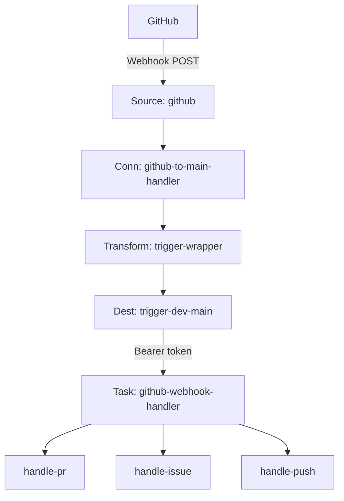
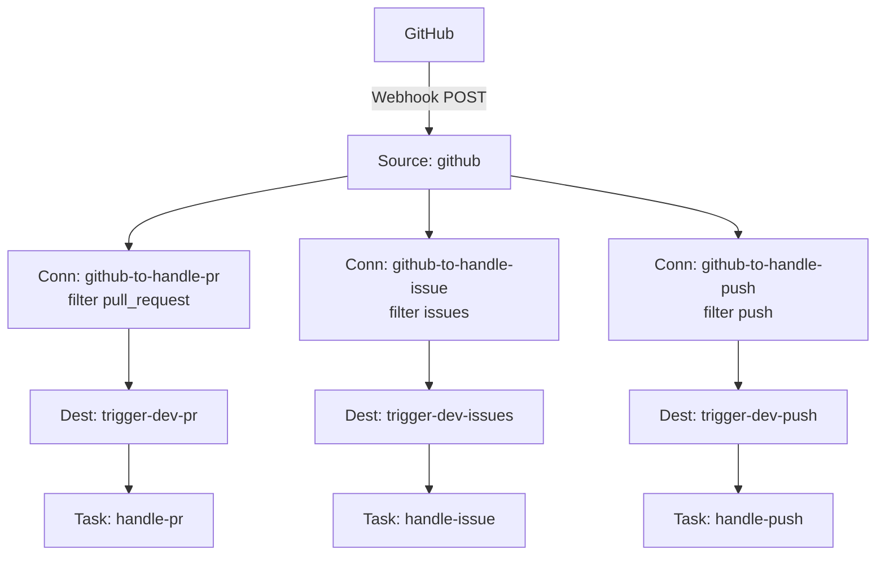

# GitHub AI Agent: Hookdeck + Trigger.dev

AI-powered GitHub automation using Hookdeck for webhook routing and Trigger.dev for task execution. This demo shows two integration patterns with three real tasks.

## What it does

GitHub webhooks flow through Hookdeck (verification, routing, transformation) into Trigger.dev tasks that use Claude to automate developer workflows:

- **PR review summary** — when a PR is opened, fetches the diff, generates a code review summary with Claude, and posts it as a PR comment
- **Issue labeler** — when an issue is created, classifies it with Claude and auto-applies labels (bug, feature, question, documentation)
- **Deployment summary** — when code is pushed to main, summarizes what shipped with Claude and posts to Slack

## Two patterns

The demo shows two ways to fan out work after the same Hookdeck ingress:

**Pattern A — Trigger fan-out (task router):** One Hookdeck connection delivers **all** GitHub events to a single Trigger.dev task, `github-webhook-handler`, which verifies once and **fans out inside Trigger.dev** (`tasks.trigger` to `handle-pr`, `handle-issue`, `handle-push` based on event type). Simpler Hookdeck surface area; branching logic lives in application code.

**Pattern B — Hookdeck fan-out (connections + filters):** **Multiple** Hookdeck connections share the same source; each connection uses **header filter rules** (e.g. `x-github-event`) so only matching events reach a dedicated Trigger.dev task. Fan-out happens **in Hookdeck** before Trigger. Each task verifies independently. More Hookdeck resources, but per-event-type observability, retries, and policies are separate.

> **Setup note:** `npm run setup` / `scripts/setup-hookdeck.sh` creates **both** Pattern A and Pattern B resources (same shared Hookdeck source `github`). A single GitHub delivery can therefore be processed **more than once** unless you disable or remove one pattern’s connections in Hookdeck for clean testing.

## Architecture

**Pattern A** is **Trigger fan-out**: one HTTP trigger hits a **router handler** task, which dispatches child tasks. **Pattern B** is **Hookdeck fan-out**: the platform splits traffic across **filtered connections** so each task’s HTTP trigger fires only for its event family.

The diagrams use short labels; **each numbered block** under a diagram explains that component and how it fits the demo.

### Pattern A — Trigger fan-out: task router (`github-webhook-handler`)



**Components (Pattern A)**

1. **GitHub** — Sends repo webhooks (e.g. `pull_request`, `issues`, `push`) to the URL shown after Hookdeck setup (the **Source** ingest URL).
2. **Source: `github`** — Shared Hookdeck **source** (`GITHUB` type). Hooks are registered against this URL; Hookdeck can verify the GitHub HMAC at ingress (see **Verification chain**).
3. **Connection: `github-to-main-handler`** — Single Hookdeck **connection** for Pattern A: source → transform → the one destination used for **Trigger fan-out** (no per-event-type filters here).
4. **Transform: `trigger-wrapper`** — Rule-level **transformation** running `hookdeck/trigger-wrapper.js`: shapes the payload for Trigger.dev HTTP triggers and sets `_hookdeck.verified` for task-side checks.
5. **Destination: `trigger-dev-main`** — Hookdeck **HTTP destination** pointing at Trigger.dev Production:  
   `https://api.trigger.dev/api/v1/tasks/github-webhook-handler/trigger` with **Bearer** auth using `TRIGGER_SECRET_KEY`.
6. **Task: `github-webhook-handler`** — **Router handler**: verifies the event once, then performs **Trigger fan-out** — `tasks.trigger` to the right worker (`handle-pr`, `handle-issue`, `handle-push`) from this task.

**Downstream tasks:** **`handle-pr`**, **`handle-issue`**, **`handle-push`** — The three demo workers (PR summary comment, issue labels, push → Slack). In Pattern A they are started **only** by the router task, not by separate Hookdeck connections.

---

### Pattern B — Hookdeck fan-out: connections + filters



**Components (Pattern B)**

Fan-out is **in Hookdeck**: one ingress on the source, then **parallel connection paths** — each path’s **filter** (e.g. on `x-github-event`) decides whether that delivery is forwarded to its destination.

1. **GitHub** — Same as Pattern A; deliveries hit the shared source URL.
2. **Source: `github`** — Same shared source; one ingress point for all events.
3. **Connection: `github-to-handle-pr`** — One branch of **Hookdeck fan-out**: **`x-github-event` = `pull_request`**. Non-matching events do not go to this destination. Uses the same **`trigger-wrapper`** transform and retry settings as in `setup-hookdeck.sh`.
4. **Connection: `github-to-handle-issue`** — Filter **`x-github-event` = `issues`** → dedicated issue path.
5. **Connection: `github-to-handle-push`** — Filter **`x-github-event` = `push`** → dedicated push path.
6. **Destinations (`trigger-dev-pr`, `trigger-dev-issues`, `trigger-dev-push`)** — Three HTTP destinations to Trigger.dev task trigger URLs: `/handle-pr/trigger`, `/handle-issue/trigger`, `/handle-push/trigger`, each with Bearer `TRIGGER_SECRET_KEY`.
7. **Tasks (`handle-pr`, `handle-issue`, `handle-push`)** — Each task’s HTTP trigger is called **directly** by Hookdeck after **connection + filter** fan-out — no `github-webhook-handler` on this path. **Each** runs **`verifyHookdeckEvent()`** independently.

## Prerequisites

- [Node.js](https://nodejs.org/) 18+
- [Hookdeck CLI](https://hookdeck.com/docs/cli) v1.2.0+
- [GitHub CLI](https://cli.github.com/) (`gh`) — authenticated
- A [Trigger.dev](https://trigger.dev) account and project
- A [Hookdeck](https://hookdeck.com) account and project
- An [Anthropic](https://console.anthropic.com) API key
- A [Slack incoming webhook URL](https://api.slack.com/messaging/webhooks) (for deployment notifications)

## Setup

```bash
cp .env.example .env
# Fill in all values (see .env.example for descriptions)

npm install
npm run setup
```

`npm run setup` does three things in order:

1. **Deploys Trigger.dev tasks to Production** — `npm run deploy:prod` (explicit `--env prod`)
2. **Creates Hookdeck resources** — source, destinations, connections, filters, and transformation (idempotent)
3. **Registers GitHub webhook** — points the webhook at the Hookdeck source URL

### Trigger.dev (Production only)

This demo is wired for **Trigger.dev Production** only:

- **`TRIGGER_SECRET_KEY`** must be your **Production** API key (`tr_prod_…`). Hookdeck destinations use it as the Bearer token, so HTTP triggers always hit Production workers.
- **`npm run setup`** and **`npm run deploy`** run **`trigger.dev deploy --env prod`**.

Task runtime secrets are **synced from your local `.env` to Trigger.dev Production on every `npm run deploy`** (see `trigger.config.ts` → `syncEnvVars`): `ANTHROPIC_API_KEY`, `GITHUB_ACCESS_TOKEN`, and optional `GITHUB_LABELS`, `SLACK_WEBHOOK_URL`. Use the **same variable names** in `.env` and in the Trigger dashboard. If you still have an old `GITHUB_TOKEN` line only, deploy copies it to `GITHUB_ACCESS_TOKEN` for sync — rename when convenient.

**Why `GITHUB_ACCESS_TOKEN` and not `GITHUB_TOKEN`?** Many tools use `GITHUB_TOKEN`, but that name is special in GitHub Actions and some cloud UIs don’t persist it reliably. `GITHUB_ACCESS_TOKEN` is explicit and syncs cleanly.

If you previously used `GITHUB_PERSONAL_ACCESS_TOKEN` in `.env`, rename that line to `GITHUB_ACCESS_TOKEN` and redeploy.

**Dashboard:** open **Production** (not Development) when checking vars.

### Environment variables

**For setup scripts** (used locally):

| Variable | Description |
|----------|-------------|
| `HOOKDECK_API_KEY` | Hookdeck project API key |
| `GITHUB_WEBHOOK_SECRET` | Shared secret for GitHub HMAC verification |
| `TRIGGER_SECRET_KEY` | Trigger.dev **Production** secret (`tr_prod_…` only) |
| `TRIGGER_PROJECT_REF` | Trigger.dev project ref |
| `GITHUB_REPO` | Target repo (e.g., `hookdeck/hookdeck-demos`) |

**For task runtime** (keep in `.env` — **synced to Production on `npm run deploy`**, or set in the Trigger.dev dashboard):

| Variable | Description |
|----------|-------------|
| `GITHUB_ACCESS_TOKEN` | GitHub API token with `repo` scope (**required** in `.env`; synced on deploy) |
| `ANTHROPIC_API_KEY` | Anthropic API key for Claude (**required** for deploy sync) |
| `GITHUB_LABELS` | Optional CSV of allowed issue labels |
| `SLACK_WEBHOOK_URL` | Optional Slack incoming webhook URL |
| `GITHUB_PUSH_SUMMARY_DEFAULT_BRANCH_ONLY` | Optional. If `true`, **`handle-push`** only runs for the repo’s default branch (`main`). **Default:** unset / `false` — **any branch** gets a Slack summary (easier for demos). |

## Deploying task changes

After editing files under `trigger/`, push new code to Trigger.dev Production:

```bash
npm run deploy
```

This also **re-syncs** the task env vars listed in `trigger.config.ts` from `.env` (so updating an API key locally and redeploying updates Production). `deploy:prod` passes **`--env-file .env`** so the deploy CLI loads your file before `syncEnvVars` runs. During deploy, Trigger prints **`Found N env vars to sync`** — `N` should match how many keys you’re syncing (typically **4** if `ANTHROPIC_API_KEY`, `GITHUB_ACCESS_TOKEN`, `GITHUB_LABELS`, and `SLACK_WEBHOOK_URL` are all set).

**CI:** use `npm run deploy:prod:ci` and export `ANTHROPIC_API_KEY`, `GITHUB_ACCESS_TOKEN`, etc. as job secrets instead of `--env-file`.

Then re-run Hooks or events as needed; Hookdeck continues to call the same task URLs.

## Project structure

```
trigger.config.ts              Trigger.dev project configuration
trigger/
  lib/
    ai.ts                      Claude helper (Anthropic SDK)
    github.ts                  GitHub API helpers (fetch-based)
    slack.ts                   Slack incoming webhook helper
    verify-hookdeck.ts         Event verification utility
  github-webhook-handler.ts    Pattern A: Trigger fan-out router handler
  handle-pr.ts                 PR code review summary
  handle-issue.ts              Issue labeler
  handle-push.ts               Deployment summary to Slack
hookdeck/
  trigger-wrapper.js           Shared Hookdeck transformation
scripts/
  setup-hookdeck.sh            Hookdeck resource creation (idempotent)
  setup-github-webhook.sh      GitHub webhook registration
```

## Verification chain

Events are verified at three levels:

1. **Hookdeck source verification** — validates the GitHub HMAC signature (`X-Hub-Signature-256`) at ingress
2. **Trigger.dev destination auth** — Bearer token authenticates Hookdeck to the Trigger.dev API
3. **Task-level verification** — `verifyHookdeckEvent()` confirms the `_hookdeck.verified` flag injected by the transformation

In Pattern A (**Trigger fan-out**), verification happens once in the router handler. In Pattern B (**Hookdeck fan-out**), each leaf task verifies independently.

## TODO

- [x] **Architecture diagrams:** Mermaid diagrams for Pattern A vs Pattern B are in **Architecture** above, with per-component descriptions under each diagram.
- [ ] **Hookdeck source verification:** Revisit event-source verification end-to-end (e.g. `x-hookdeck-verified` vs transform-time `context.connection.source.verification`, `_hookdeck.verified` semantics, and docs alignment). See `hookdeck/trigger-wrapper.js` and `trigger/lib/verify-hookdeck.ts`.
- [ ] **Development environment & prod parity:** Explore what a **dev** setup would look like (Trigger.dev Development + `trigger dev`, Hookdeck project or connections, webhook routing), how to **migrate or promote** to Production, and how to keep a dev stack **effectively matching prod** (env vars, connection names, transformation code, secrets rotation). This demo is Production-only today; document or script an optional path if we add it later.
