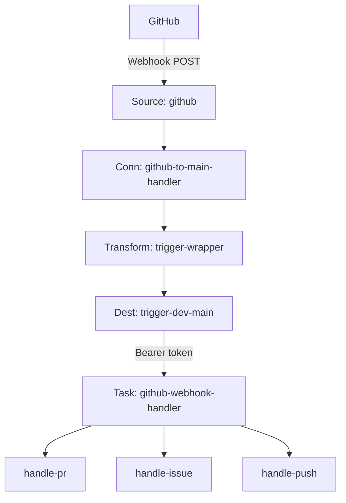
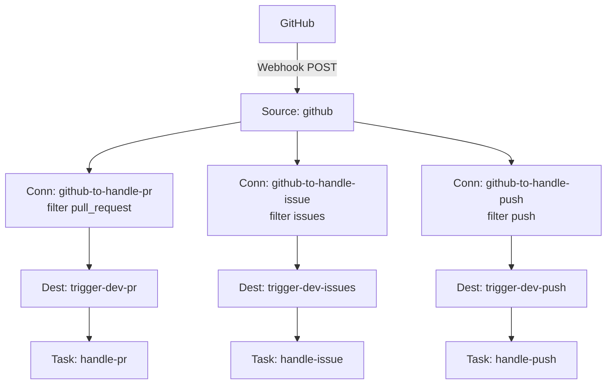

# GitHub AI Agent: Hookdeck + Trigger.dev

AI-powered GitHub automation using Hookdeck for webhook routing and Trigger.dev for task execution. This demo shows two integration patterns with three real tasks.

**Why Hookdeck in front of Trigger.dev:** Trigger [HTTP triggers](https://trigger.dev/docs/triggers/http) are Trigger API URLs secured with your project secret. GitHub (like Stripe, Twilio, etc.) sends webhooks to a URL you give it and signs them its own way. Without Hookdeck you typically run a **server** to verify that traffic and forward it to Trigger in the right shape with your secret. Hookdeck is that ingress: verify at the source, transform if needed, and deliver to Trigger with Bearer auth—so you are not required to host the receiver yourself. The two shapes below are about **how** Hookdeck fans out to tasks, not about skipping the gateway.

## What it does

GitHub webhooks flow through Hookdeck (verification, routing, transformation) into Trigger.dev tasks that use Claude to automate developer workflows:

- **PR review summary** — on PR **opened** or **updated** (`synchronize`), fetches the diff, asks Claude for a summary, and upserts one PR comment (body includes `<!-- ai-review-summary -->` so later runs PATCH the same comment)
- **Issue labeler** — when an issue is created, classifies it with Claude and auto-applies labels (bug, feature, question, documentation)
- **Deployment summary** — on **push**, summarizes commits with Claude and posts to Slack (**any branch** by default; set `GITHUB_PUSH_SUMMARY_DEFAULT_BRANCH_ONLY=true` for default-branch only)

## Demo scripts (optional)

After setup, you can trigger real GitHub activity with **`gh`** (no manual UI):

| Command | Effect |
|--------|--------|
| `npm run demo:issue` | Opens a disposable issue → issue labeler task |
| `npm run demo:push` | Pushes an **empty commit** on branch **`demo/hookdeck-trigger`** → push / Slack task |
| `npm run demo:pr` | Runs `demo:push`, then opens a PR if needed → PR review task |

Requires a **clean** `git status` for push/PR. Video script, branch cleanup, and suggested order: [`walkthrough/README.md`](walkthrough/README.md).

## Two integration shapes

The demo shows two ways to fan out work after the same Hookdeck ingress (older write-ups may call these **Pattern A** and **Pattern B**):

**Trigger.dev task router:** One Hookdeck connection delivers **all** GitHub events to a single Trigger.dev task, `github-webhook-handler`, which **fans out inside Trigger.dev** (`tasks.trigger` to `handle-pr`, `handle-issue`, `handle-push` based on event type). GitHub authenticity was already checked at the Hookdeck source. Child triggers use **[idempotency keys](https://trigger.dev/docs/idempotency)** scoped from GitHub’s **`X-GitHub-Delivery`** header (forwarded as `github_delivery_id` in the transform) so router retries or duplicate deliveries do not enqueue duplicate child runs. Simpler Hookdeck surface area; branching logic lives in application code.

**Hookdeck connection routing:** **Multiple** Hookdeck connections share the same source; each connection uses **header filter rules** (e.g. `x-github-event`) so only matching events reach a dedicated Trigger.dev task. Fan-out happens **in Hookdeck** before Trigger. Each task runs as its own root run. More Hookdeck resources, but per-event-type observability, retries, and policies are separate.

> **Setup note:** `npm run setup` / `scripts/setup-hookdeck.sh` creates **both** the task router connection and the Hookdeck-routed connections (same shared Hookdeck source `github`). A single GitHub delivery can therefore be processed **more than once** unless you disable or remove one path’s connections in Hookdeck for clean testing.

## Architecture

The **Trigger.dev task router** path is: one HTTP trigger hits the **router** task (`github-webhook-handler`), which dispatches child tasks. **Hookdeck connection routing** means the platform splits traffic across **filtered connections** so each task’s HTTP trigger fires only for its event family.

The diagrams use short labels; **each numbered block** under a diagram explains that component and how it fits the demo.

### Trigger.dev task router (`github-webhook-handler`)



**Components (task router path)**

1. **GitHub** — Sends repo webhooks (e.g. `pull_request`, `issues`, `push`) to the URL shown after Hookdeck setup (the **Source** ingest URL).
2. **Source: `github`** — Shared Hookdeck **source** (`GITHUB` type). Hooks are registered against this URL; Hookdeck can verify the GitHub HMAC at ingress (see **Verification chain**).
3. **Connection: `github-to-main-handler`** — Single Hookdeck **connection** for the task router: source → transform → the one destination used for **Trigger.dev-side fan-out** (no per-event-type filters here).
4. **Transform: `trigger-wrapper`** — Rule-level **transformation** running `hookdeck/trigger-wrapper.js`: wraps the body as `{ payload: { event, action, … } }` for Trigger.dev HTTP triggers and copies `X-GitHub-Event` into `payload.event`.
5. **Destination: `trigger-dev-main`** — Hookdeck **HTTP destination** pointing at Trigger.dev Production:  
   `https://api.trigger.dev/api/v1/tasks/github-webhook-handler/trigger` with **Bearer** auth using `TRIGGER_SECRET_KEY`.
6. **Task: `github-webhook-handler`** — **Router task**: reads `payload.event` / `payload.action`, then performs **Trigger.dev-side fan-out** — `tasks.trigger` to the right child task (`handle-pr`, `handle-issue`, `handle-push`).

**Downstream tasks:** **`handle-pr`**, **`handle-issue`**, **`handle-push`** — The three demo tasks (PR summary comment, issue labels, push → Slack). On the task router path they are started **only** by the router task, not by separate Hookdeck connections.

---

### Hookdeck connection routing



**Components (Hookdeck connection routing)**

Fan-out is **in Hookdeck**: one ingress on the source, then **parallel connection paths** — each path’s **filter** (e.g. on `x-github-event`) decides whether that delivery is forwarded to its destination.

1. **GitHub** — Same as the task router path; deliveries hit the shared source URL.
2. **Source: `github`** — Same shared source; one ingress point for all events.
3. **Connection: `github-to-handle-pr`** — One branch of **Hookdeck-side routing**: **`x-github-event` = `pull_request`**. Non-matching events do not go to this destination. Uses the same **`trigger-wrapper`** transform and retry settings as in `setup-hookdeck.sh`.
4. **Connection: `github-to-handle-issue`** — Filter **`x-github-event` = `issues`** → dedicated issue path.
5. **Connection: `github-to-handle-push`** — Filter **`x-github-event` = `push`** → dedicated push path.
6. **Destinations (`trigger-dev-pr`, `trigger-dev-issues`, `trigger-dev-push`)** — Three HTTP destinations to Trigger.dev task trigger URLs: `/handle-pr/trigger`, `/handle-issue/trigger`, `/handle-push/trigger`, each with Bearer `TRIGGER_SECRET_KEY`.
7. **Tasks (`handle-pr`, `handle-issue`, `handle-push`)** — Each task’s HTTP trigger is called **directly** by Hookdeck after **connection + filter** fan-out — no `github-webhook-handler` on this path. Task code assumes only Hookdeck (with your Bearer token) can reach those URLs; GitHub authenticity was already enforced at the Hookdeck source.

## Prerequisites

- [Node.js](https://nodejs.org/) 18+
- [Hookdeck CLI](https://hookdeck.com/docs/cli) v1.2.0+
- [GitHub CLI](https://cli.github.com/) (`gh`) — authenticated
- A [Trigger.dev](https://trigger.dev) account and project
- A [Hookdeck](https://hookdeck.com) account and project
- An [Anthropic](https://console.anthropic.com) API key
- A [Slack incoming webhook URL](https://api.slack.com/messaging/webhooks) (for deployment notifications)

## Setup

```bash
cp .env.example .env
# Fill in all values (see .env.example for descriptions)

npm install
npm run setup
```

`npm run setup` does three things in order:

1. **Deploys Trigger.dev tasks to Production** — `npm run deploy:prod` (explicit `--env prod`)
2. **Creates Hookdeck resources** — source, destinations, connections, filters, and transformation (idempotent)
3. **Registers GitHub webhook** — points the webhook at the Hookdeck source URL

### Trigger.dev (Production only)

This demo is wired for **Trigger.dev Production** only:

- **`TRIGGER_SECRET_KEY`** must be your **Production** API key (`tr_prod_…`). Hookdeck destinations use it as the Bearer token, so HTTP triggers always hit Production task runs.
- **`npm run setup`** and **`npm run deploy`** run **`trigger.dev deploy --env prod`**.

Task runtime secrets are **synced from your local `.env` to Trigger.dev Production on every `npm run deploy`** (see `trigger.config.ts` → `syncEnvVars`): `ANTHROPIC_API_KEY`, `GITHUB_ACCESS_TOKEN`, and optional `GITHUB_LABELS`, `SLACK_WEBHOOK_URL`. Use the **same variable names** in `.env` and in the Trigger dashboard. If you still have an old `GITHUB_TOKEN` line only, deploy copies it to `GITHUB_ACCESS_TOKEN` for sync — rename when convenient.

**Why `GITHUB_ACCESS_TOKEN` and not `GITHUB_TOKEN`?** Many tools use `GITHUB_TOKEN`, but that name is special in GitHub Actions and some cloud UIs don’t persist it reliably. `GITHUB_ACCESS_TOKEN` is explicit and syncs cleanly.

If you previously used `GITHUB_PERSONAL_ACCESS_TOKEN` in `.env`, rename that line to `GITHUB_ACCESS_TOKEN` and redeploy.

**Dashboard:** open **Production** (not Development) when checking vars.

### Environment variables

**For setup scripts** (used locally):

| Variable | Description |
|----------|-------------|
| `HOOKDECK_API_KEY` | Hookdeck project API key |
| `GITHUB_WEBHOOK_SECRET` | Shared secret for GitHub HMAC verification |
| `TRIGGER_SECRET_KEY` | Trigger.dev **Production** secret (`tr_prod_…` only) |
| `TRIGGER_PROJECT_REF` | Trigger.dev project ref |
| `GITHUB_REPO` | Target repo (e.g., `hookdeck/hookdeck-demos`) |

**For task runtime** (keep in `.env` — **synced to Production on `npm run deploy`**, or set in the Trigger.dev dashboard):

| Variable | Description |
|----------|-------------|
| `GITHUB_ACCESS_TOKEN` | GitHub API token with `repo` scope (**required** in `.env`; synced on deploy) |
| `ANTHROPIC_API_KEY` | Anthropic API key for Claude (**required** for deploy sync) |
| `GITHUB_LABELS` | Optional CSV of allowed issue labels |
| `SLACK_WEBHOOK_URL` | Optional Slack incoming webhook URL |
| `GITHUB_PUSH_SUMMARY_DEFAULT_BRANCH_ONLY` | Optional. If `true`, **`handle-push`** only runs for the repo’s default branch (`main`). **Default:** unset / `false` — **any branch** gets a Slack summary (easier for demos). |

## Deploying task changes

After editing files under `trigger/`, push new code to Trigger.dev Production:

```bash
npm run deploy
```

This also **re-syncs** the task env vars listed in `trigger.config.ts` from `.env` (so updating an API key locally and redeploying updates Production). `deploy:prod` passes **`--env-file .env`** so the deploy CLI loads your file before `syncEnvVars` runs. During deploy, Trigger prints **`Found N env vars to sync`** — `N` should match how many keys you’re syncing (typically **4** if `ANTHROPIC_API_KEY`, `GITHUB_ACCESS_TOKEN`, `GITHUB_LABELS`, and `SLACK_WEBHOOK_URL` are all set).

**CI:** use `npm run deploy:prod:ci` and export `ANTHROPIC_API_KEY`, `GITHUB_ACCESS_TOKEN`, etc. as job secrets instead of `--env-file`.

Then re-run Hooks or events as needed; Hookdeck continues to call the same task URLs.

If you change `hookdeck/trigger-wrapper.js`, push the new code to Hookdeck by re-running `npm run setup:hookdeck` (or upsert `github-to-main-handler` with fresh `--rule-transform-code`). The transformation name `trigger-wrapper` is unique in the project — that upsert updates the single shared definition; every connection that references the name picks it up automatically.

## Project structure

```
trigger.config.ts              Trigger.dev project configuration
trigger/
  lib/
    ai.ts                      Claude helper (Anthropic SDK)
    github.ts                  GitHub API helpers (fetch-based)
    slack.ts                   Slack incoming webhook helper
  github-webhook-handler.ts    Trigger.dev task router
  handle-pr.ts                 PR code review summary
  handle-issue.ts              Issue labeler
  handle-push.ts               Deployment summary to Slack
hookdeck/
  trigger-wrapper.js           Shared Hookdeck transformation
scripts/
  setup-hookdeck.sh            Hookdeck resource creation (idempotent)
  setup-github-webhook.sh      GitHub webhook registration
```

## Verification chain

Events are verified at two levels:

1. **Hookdeck source verification** — validates the GitHub HMAC signature (`X-Hub-Signature-256`) at ingress before the transform or destination runs.
2. **Trigger.dev destination auth** — Bearer token (`TRIGGER_SECRET_KEY`) so only callers that know the secret can invoke your task trigger URLs.

The demo tasks do not re-verify GitHub signatures themselves; they trust that Hookdeck accepted the event at the source.

## Optional follow-ups (not required for the demo)

The demo is complete for the Production path described above; the long-form article lives with Hookdeck’s **platform guides** on hookdeck.com. If you extend this repo later, consider:

- **Hookdeck source verification docs** — Keep narrative aligned with `hookdeck/trigger-wrapper.js` if Hookdeck adds new headers or transform APIs.
- **Development / staging** — This package targets Trigger.dev **Production** only; a second Hookdeck project + `tr_dev_…` + `trigger dev` is possible but not scripted here.
